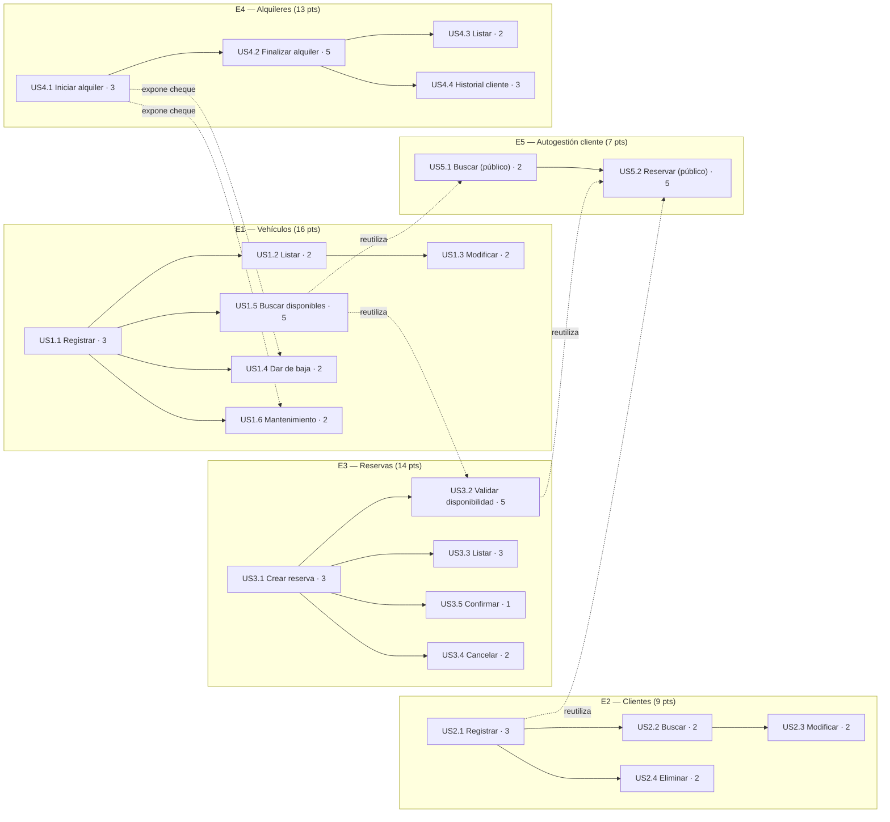

# Fase 1 — Épicas e Historias de Usuario

## 1. Problema

Una empresa de alquiler de vehículos gestiona hoy su operación de forma manual/desordenada
(planillas, papel, memoria). Esto genera errores como alquilar dos veces el mismo vehículo en las
mismas fechas, perder el registro de qué vehículo está con qué cliente, o no saber qué unidades
están disponibles en un momento dado.

## 2. Objetivo

Construir un sistema que centralice el control de vehículos, clientes, reservas y alquileres, para
que el personal de la empresa pueda operar sin errores de disponibilidad y con información
actualizada del estado de la flota.

## 3. Usuarios / Actores

| Actor | Descripción |
|---|---|
| **Empleado** | Persona que usa el sistema día a día: registra vehículos, gestiona reservas y alquileres creados por cualquier vía. |
| **Cliente** | Persona que alquila un vehículo. Puede reservar **por su cuenta** desde un formulario público, **sin necesidad de cuenta ni login** — en cada reserva completa sus datos básicos obligatorios (nombre, apellido, documento, email, teléfono). |

> **Decisión confirmada**: no se maneja seguridad/autenticación en el MVP (ni para Empleado ni para
> Cliente). El "autoservicio" del cliente no es un portal con cuenta propia, sino un formulario de
> reserva público que exige datos básicos obligatorios. Si el documento ingresado ya existe como
> Cliente (porque un empleado lo cargó antes, o porque reservó previamente), el sistema reutiliza
> ese registro en vez de duplicarlo; si no existe, lo crea.

## 4. Épicas

El MVP se dividió en 5 épicas: las 4 originales de la consigna, más 1 nueva para que el cliente
pueda reservar directamente sin pasar por un empleado (sin login, con datos básicos obligatorios):

- **E1 — Gestión de Vehículos**
- **E2 — Gestión de Clientes**
- **E3 — Gestión de Reservas**
- **E4 — Gestión de Alquileres**
- **E5 — Autogestión de Reservas del Cliente** *(nueva, sin login)*

---

## E1 — Gestión de Vehículos

*Como empleado, necesito administrar la flota de vehículos para saber qué unidades existen y
cuáles están disponibles para alquilar.*

| ID | Historia de usuario | Pts | Depende de | Criterios de aceptación |
|---|---|---|---|---|
| **US1.1** | Como empleado, quiero **registrar un vehículo nuevo** (patente, marca, modelo, año, tipo, precio por día) para poder ofrecerlo en alquiler. | 3 | — | - No se permite guardar sin patente, marca, modelo o precio por día. - No se permite registrar dos vehículos con la misma patente. - Al crearse, el vehículo queda con estado "Disponible". |
| **US1.2** | Como empleado, quiero **ver el listado de vehículos** con su estado actual (Disponible / Alquilado / Mantenimiento) para saber de un vistazo qué hay en la flota. | 2 | US1.1 | - El listado muestra patente, marca, modelo y estado. - Se puede filtrar por estado. |
| **US1.3** | Como empleado, quiero **modificar los datos de un vehículo** para corregir errores de carga o actualizar información (ej. precio por día). | 2 | US1.1 | - No se puede modificar la patente a una que ya exista en otro vehículo. - Los campos obligatorios siguen siendo obligatorios al editar. |
| **US1.4** | Como empleado, quiero **dar de baja un vehículo** que ya no pertenece a la flota. | 2 | US1.1, US4.1 *(chequea que no tenga alquiler activo)* | - No se puede dar de baja un vehículo con un alquiler activo. - Un vehículo dado de baja no aparece más en las búsquedas de disponibilidad. |
| **US1.5** | Como empleado, quiero **buscar vehículos disponibles en un rango de fechas** para poder ofrecérselos a un cliente que llama. | 5 | US1.1, US3.1, US4.1 *(cruza datos de reserva/alquiler)* | - La búsqueda excluye vehículos con una reserva o alquiler que se solape con el rango pedido. - Si no hay resultados, se informa claramente que no hay unidades disponibles. |
| **US1.6** | Como empleado, quiero **marcar un vehículo como "En mantenimiento"** fuera del flujo de un alquiler (ej. service programado), para sacarlo de disponibilidad sin que haya un alquiler de por medio. | 2 | US1.1, US4.1 *(chequea alquiler activo)* | - No se puede marcar en mantenimiento un vehículo con un alquiler activo. - Un vehículo en mantenimiento no aparece en la búsqueda de disponibilidad (US1.5/US5.1). - El empleado puede volver a marcarlo como "Disponible" cuando termina el service. |

*Subtotal E1: 16 puntos.*

---

## E2 — Gestión de Clientes

*Como empleado, necesito administrar los datos de los clientes para poder asociarlos a reservas y
alquileres.*

| ID | Historia de usuario | Pts | Depende de | Criterios de aceptación |
|---|---|---|---|---|
| **US2.1** | Como empleado, quiero **registrar un cliente nuevo** (nombre, apellido, documento, email, teléfono) para poder hacerle una reserva o un alquiler. | 3 | — | - No se permite guardar sin nombre, apellido o documento. - No se permite registrar dos clientes con el mismo documento. |
| **US2.2** | Como empleado, quiero **buscar un cliente** por documento o apellido para no tener que cargarlo de nuevo si ya existe. | 2 | US2.1 | - La búsqueda por documento devuelve como máximo un resultado (es único). - La búsqueda por apellido puede devolver varios resultados. |
| **US2.3** | Como empleado, quiero **modificar los datos de un cliente** (ej. teléfono, email) para mantenerlos actualizados. | 2 | US2.1 | - No se puede modificar el documento a uno que ya exista en otro cliente. |
| **US2.4** | Como empleado, quiero **eliminar un cliente** que ya no es relevante (ej. cargado por error). | 2 | US2.1, US3.1, US4.1 *(chequea reservas/alquileres activos)* | - No se puede eliminar un cliente con reservas o alquileres activos. |

*Subtotal E2: 9 puntos.*

---

## E3 — Gestión de Reservas

*Como empleado, necesito reservar un vehículo para un cliente en fechas futuras, garantizando que
no se pisen dos reservas del mismo vehículo.*

| ID | Historia de usuario | Pts | Depende de | Criterios de aceptación |
|---|---|---|---|---|
| **US3.1** | Como empleado, quiero **crear una reserva** indicando cliente, vehículo, fecha de inicio y fecha de fin. | 3 | US1.1, US2.1 | - La fecha de fin debe ser posterior a la de inicio. - El vehículo debe existir y no estar dado de baja. - El cliente debe existir. |
| **US3.2** | Como empleado, cuando creo una reserva, quiero que **el sistema valide que el vehículo esté disponible** en ese rango de fechas, para no reservar dos veces la misma unidad. | 5 | US3.1, US1.5 *(misma lógica de solapamiento)* | - Si el rango se solapa con otra reserva CONFIRMADA o PENDIENTE del mismo vehículo, la reserva se rechaza con un mensaje claro. |
| **US3.3** | Como empleado, quiero **ver el listado de reservas**, filtrando por cliente, vehículo o estado, para hacer seguimiento. | 3 | US3.1 | - El listado muestra cliente, vehículo, fechas y estado. |
| **US3.4** | Como empleado, quiero **cancelar una reserva** que el cliente no va a usar, para liberar el vehículo en esas fechas. | 2 | US3.1 | - Una reserva cancelada no vuelve a bloquear la disponibilidad del vehículo. - No se puede cancelar una reserva que ya se convirtió en alquiler. |
| **US3.5** | Como empleado, quiero **confirmar una reserva pendiente** para dejar asentado que el cliente la validó (ej. con una seña). | 1 | US3.1 | - Solo una reserva en estado PENDIENTE puede pasar a CONFIRMADA. |

*Subtotal E3: 14 puntos.*

---

## E4 — Gestión de Alquileres

*Como empleado, necesito registrar el momento en que el cliente retira y devuelve el vehículo, y
saber cuánto tiene que pagar.*

| ID | Historia de usuario | Pts | Depende de | Criterios de aceptación |
|---|---|---|---|---|
| **US4.1** | Como empleado, quiero **iniciar un alquiler** (retiro del vehículo) a partir de una reserva confirmada, o de forma directa sin reserva previa. | 3 | US1.1, US2.1, US3.5 *(reserva confirmada, opcional)* | - Al iniciar el alquiler, el vehículo pasa a estado "Alquilado". - No se puede iniciar un alquiler sobre un vehículo que ya está "Alquilado". |
| **US4.2** | Como empleado, quiero **finalizar un alquiler** (devolución del vehículo) registrando la fecha real de devolución, para calcular el monto a cobrar. | 5 | US4.1 | - El monto total se calcula en base a los días efectivamente alquilados y el precio por día del vehículo. - Al finalizar, el vehículo vuelve a estado "Disponible" (o "Mantenimiento" si el empleado lo marca así). |
| **US4.3** | Como empleado, quiero **ver el listado de alquileres activos y finalizados**, para saber qué vehículos están afuera y cuáles ya volvieron. | 2 | US4.1 | - El listado muestra cliente, vehículo, fechas, estado y monto. |
| **US4.4** | Como empleado, quiero **consultar el historial de alquileres de un cliente puntual**, para atenderlo mejor si llama con una consulta o reclamo. | 3 | US2.1, US4.1 | - Se puede buscar el historial por documento del cliente. - El historial muestra alquileres pasados y activos, con fechas y vehículo. |

*Subtotal E4: 13 puntos.*

---

## E5 — Autogestión de Reservas del Cliente

*Como cliente, necesito poder reservar un vehículo por mi cuenta sin depender de un empleado, sin
necesidad de crear una cuenta.*

| ID | Historia de usuario | Pts | Depende de | Criterios de aceptación |
|---|---|---|---|---|
| **US5.1** | Como cliente, quiero **buscar vehículos disponibles** en un rango de fechas para elegir cuál alquilar. | 2 | US1.5 *(reutiliza la misma lógica, expuesta sin login)* | - Misma lógica de disponibilidad que US1.5 (no muestra vehículos con solapamiento de reserva/alquiler, ni en mantenimiento). - No requiere ningún dato personal para buscar (es de lectura pública). |
| **US5.2** | Como cliente, quiero **crear una reserva completando mis datos básicos** (nombre, apellido, documento, email, teléfono) eligiendo un vehículo disponible y un rango de fechas, sin necesidad de registrarme. | 5 | US5.1, US2.1 *(reutiliza-o-crea cliente)*, US3.2 *(misma validación de disponibilidad)* | - Nombre, apellido, documento y una forma de contacto (email o teléfono) son obligatorios. - Si ya existe un Cliente con ese documento, se reutiliza ese registro (no se duplica). - Se aplican las mismas validaciones de disponibilidad que US3.2. |

*Subtotal E5: 7 puntos.*

*Fuera de alcance del MVP (a propósito, para no sobre-diseñar): que el cliente pueda ver o cancelar
sus propias reservas por sí mismo (requeriría algún mecanismo de identificación/login). Para
consultar o cancelar una reserva, el cliente contacta al empleado, que lo hace por él usando US3.3
y US3.4.*

---

## 5. Priorización (orden sugerido para desarrollar)

1. E1 — Gestión de Vehículos *(no depende de nada más, es la base)*
2. E2 — Gestión de Clientes *(independiente de E1)*
3. E3 — Gestión de Reservas *(depende de E1 y E2)*
4. **E5 — Autogestión de Reservas del Cliente** *(depende de E1 y E2/E3, reusa su lógica)*
5. E4 — Gestión de Alquileres *(depende de E1, E2 y, opcionalmente, E3)*

## 6. Estimación (puntos de historia)

Estimación relativa en escala de Fibonacci (1-2-3-5-8), a criterio del equipo — sirve para
priorizar y planificar sprints en la Fase 6, no es una medida de tiempo exacta.

| Épica | Puntos |
|---|---|
| E1 — Gestión de Vehículos | 16 |
| E2 — Gestión de Clientes | 9 |
| E3 — Gestión de Reservas | 14 |
| E4 — Gestión de Alquileres | 13 |
| E5 — Autogestión de Reservas del Cliente | 7 |
| **Total** | **59** |

Las historias más grandes (5 puntos: US1.5, US3.2, US4.2, US5.2) comparten la parte más compleja
del dominio: la lógica de solapamiento de fechas y el cálculo de disponibilidad/monto. Conviene
resolverla bien una vez (en US1.5/US3.2) y reutilizarla en el resto, en vez de reimplementarla.

## 7. Dependencias entre historias

Cada tabla de historias (secciones E1-E5) tiene ahora una columna **"Depende de"** con el detalle
historia por historia. Como resumen, los dos tipos de dependencia que aparecen son:

- **Dependencias de flujo** (una historia necesita que otra ya funcione porque opera sobre datos
  que esa otra crea): p. ej. US3.1 depende de US1.1 y US2.1 (necesita que existan vehículos y
  clientes para poder reservarlos); US4.1 depende de US3.5 (una reserva confirmada) o puede
  hacerse directo; US4.2 depende de US4.1 (no se puede finalizar un alquiler que no empezó).
- **Dependencias de lógica reutilizada** (una historia reutiliza una regla de negocio ya resuelta
  en otra, en vez de reimplementarla): US3.2 y US5.1/US5.2 reutilizan la lógica de disponibilidad
  de US1.5; US1.4 y US1.6 reutilizan el chequeo de "alquiler activo" que expone US4.1.

Esto también explica por qué E5 (Autogestión del Cliente) no puede arrancarse antes que E1 y E3: no
tiene datos ni reglas propias, es una fachada pública sobre la lógica de E1/E3.

## 8. User story map

Vista de las historias agrupadas por épica (columnas, en el orden de prioridad de la sección 5) y
ordenadas de arriba hacia abajo dentro de cada columna según la secuencia lógica de implementación.
Las flechas punteadas cruzando columnas marcan las dependencias de lógica reutilizada de la
sección 7 (no todas las dependencias de flujo están dibujadas, para no saturar el diagrama).

## 9. Qué falta validar antes de pasar a la Fase 2

- [x] ¿Están de acuerdo el problema/objetivo del punto 1 y 2? → **Sí, confirmado.**
- [x] ¿El actor único "Empleado" es correcto, o la empresa quiere autogestión de clientes? →
      **Se confirmó autogestión de clientes, sin cuenta/login** — el cliente completa datos
      básicos obligatorios en cada reserva (E5).
- [x] ¿Están bien las épicas/historias nuevas (US1.6, US4.4, E5)? → **Sí, confirmado.**
- [x] ¿Login para Empleado y/o Cliente? → **No, no se maneja seguridad en el MVP.**

**Fase 1 cerrada.** Se pasa a la Fase 2 (Requerimientos funcionales y no funcionales) en
`docs/02-requerimientos.md`.
