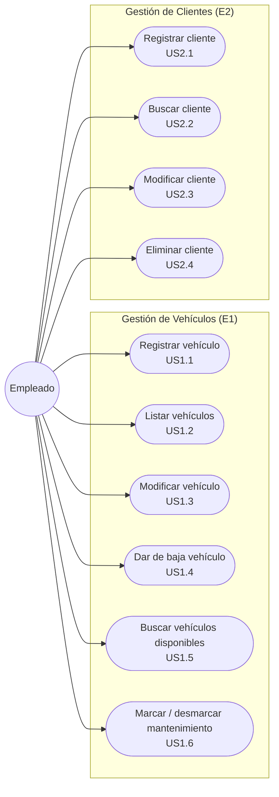
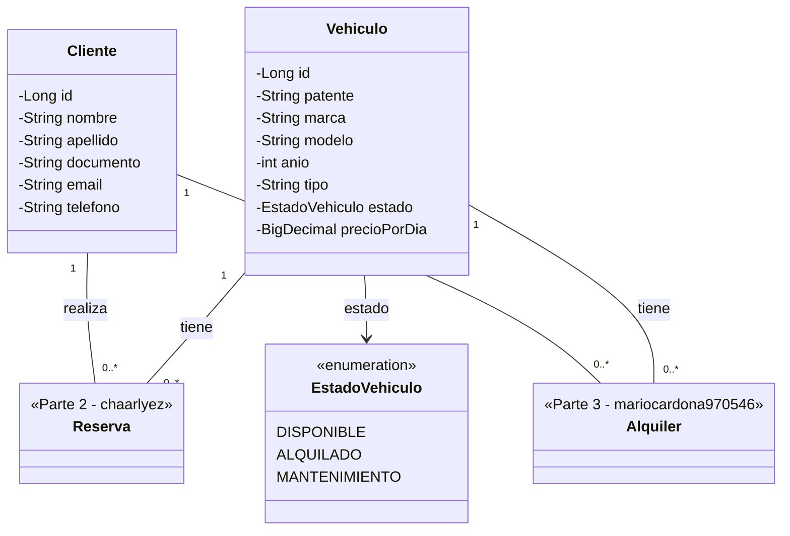
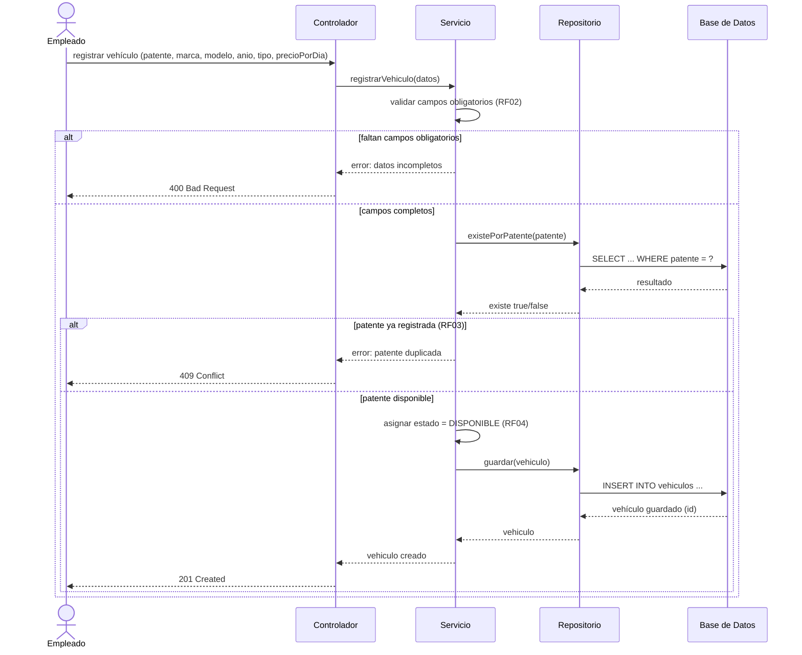
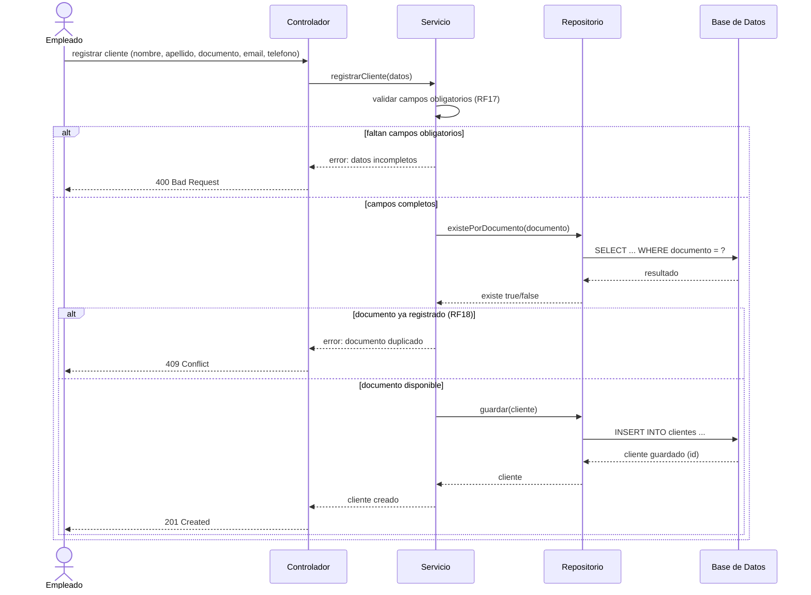
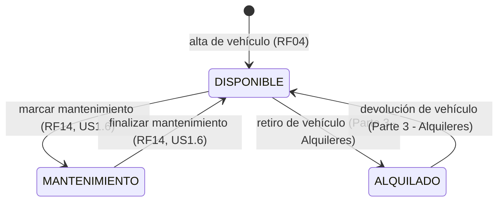
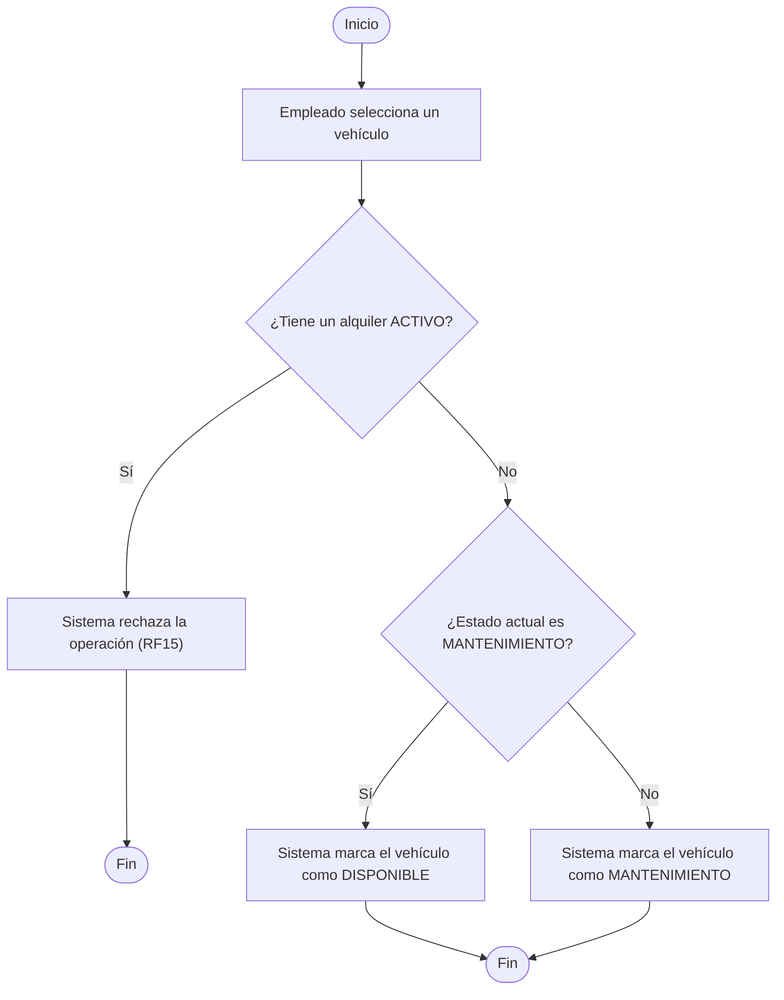

# Fase 3 — Parte 1 (Johann-Tafur): Vehículos y Clientes

Alcance: **E1 — Gestión de Vehículos** y **E2 — Gestión de Clientes**
(`docs/01-epicas-historias-usuario.md`), 25 puntos de historia. Trazabilidad completa a los
requerimientos funcionales y reglas de negocio de `docs/02-requerimientos.md`.

Ver la división completa de la Fase 3 en `docs/03-uml/00-asignacion.md`.

## 1. Diagrama de casos de uso

**Relaciones `<<include>>` con otras partes** (dependen de datos de Reserva/Alquiler, fuera del
alcance de esta parte, ver `docs/03-uml/00-asignacion.md`):

| Caso de uso | Incluye | Regla |
|---|---|---|
| UC4 — Dar de baja vehículo | Verificar que el vehículo no tenga un alquiler ACTIVO | RF11 |
| UC5 — Buscar vehículos disponibles | Excluir vehículos con reserva solapada o alquiler ACTIVO | RF13, RN12, RN14 |
| UC6 — Marcar/desmarcar mantenimiento | Verificar que el vehículo no tenga un alquiler ACTIVO | RF15 |
| UC10 — Eliminar cliente | Verificar que el cliente no tenga reservas/alquileres activos | RF24, RN08 |

## 2. Diagrama de clases (aporte de esta parte)

El diagrama de clases es único para todo el sistema; esta parte aporta `Vehiculo` y `Cliente`.
`Reserva` y `Alquiler` se muestran como referencia (los completan las otras partes al integrar).

Notas:
- `documento` (Cliente) y `patente` (Vehiculo) son identificadores de negocio únicos — RN06, RN07.
- Al crearse un `Vehiculo`, `estado` queda en `DISPONIBLE` automáticamente (RF04).

## 3. Diagramas de secuencia

### 3.1 Registrar vehículo nuevo (US1.1 — RF01, RF02, RF03, RF04)

### 3.2 Registrar cliente nuevo (US2.1 — RF16, RF17, RF18)

## 4. Diagrama de estados y de actividades

### 4.1 Diagrama de estados de Vehiculo (RN01)

Las transiciones hacia/desde `ALQUILADO` las genera el flujo de Alquileres (Parte 3); se muestran
acá solo para que el diagrama de estados quede completo.

### 4.2 Diagrama de actividades: marcar/desmarcar mantenimiento (US1.6 — RF14, RF15)

## 5. Trazabilidad

| Diagrama | Historias | Requerimientos / Reglas |
|---|---|---|
| Casos de uso | US1.1–US1.6, US2.1–US2.4 | RF01–RF24 |
| Clases (Vehiculo, Cliente) | US1.1, US2.1 | RN01, RN06, RN07 |
| Secuencia — registrar vehículo | US1.1 | RF01, RF02, RF03, RF04 |
| Secuencia — registrar cliente | US2.1 | RF16, RF17, RF18 |
| Estados de Vehiculo | US1.1, US1.6 | RN01, RF04, RF14 |
| Actividades — mantenimiento | US1.6 | RF14, RF15 |
