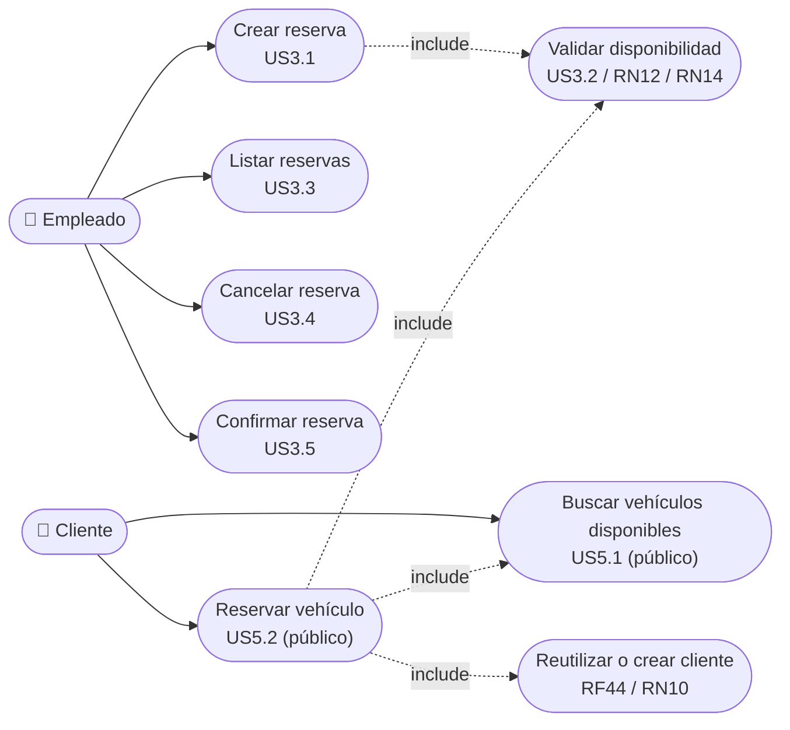
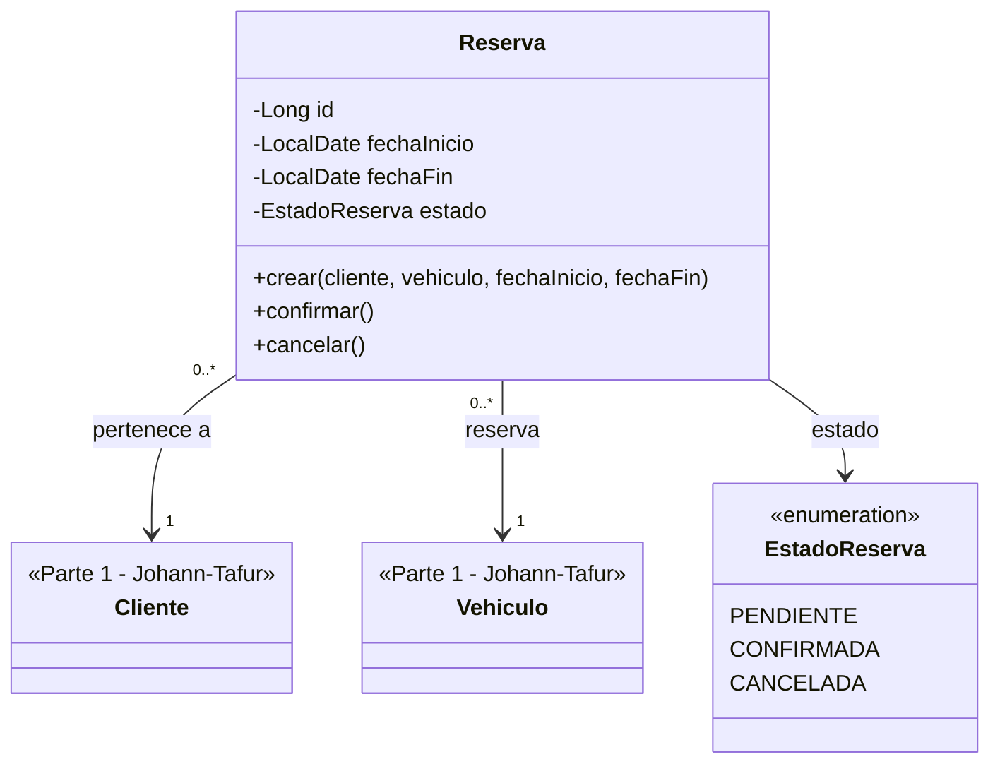
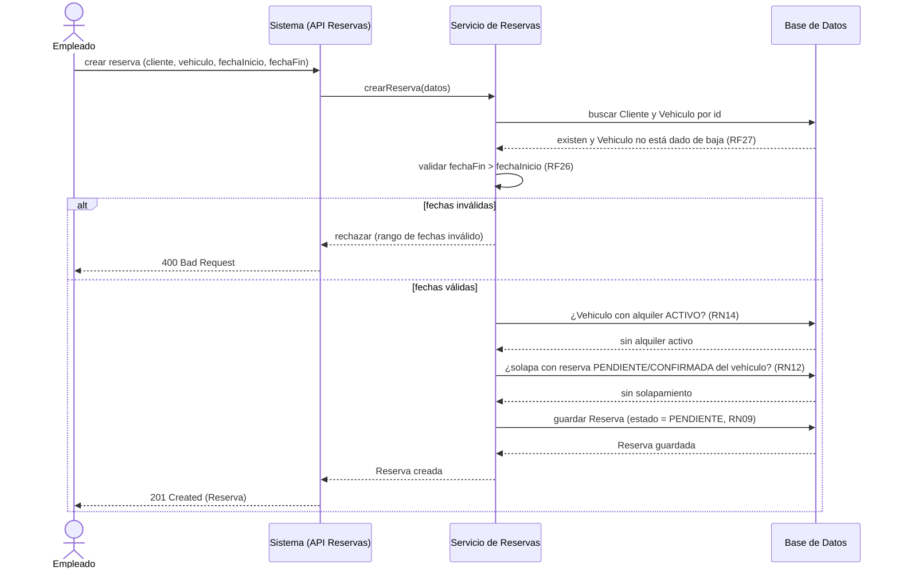
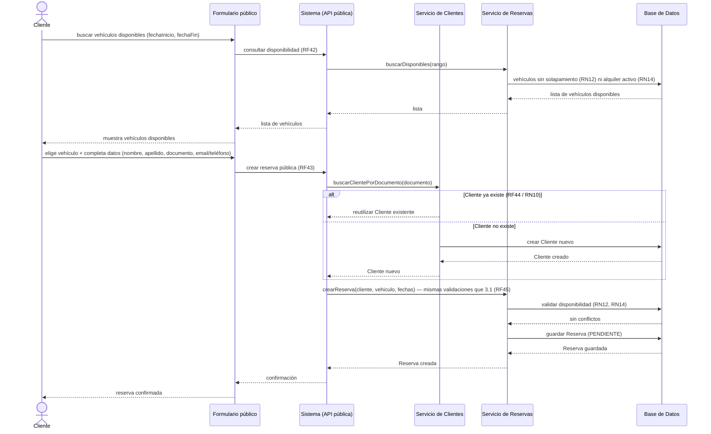
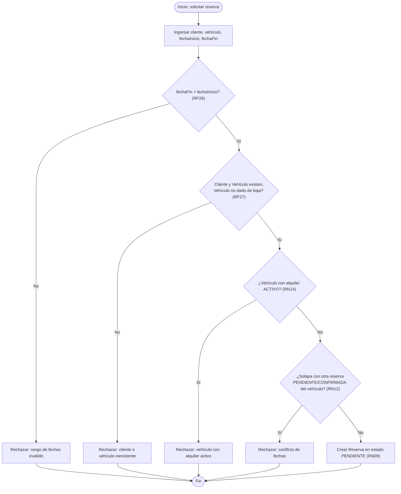
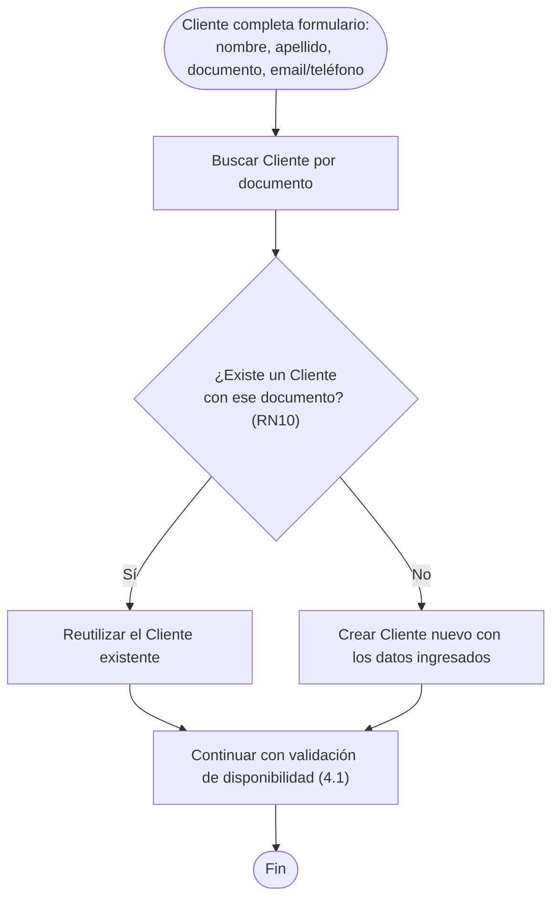

# Fase 3 — Parte 2 (chaarlyez): Reservas y Autogestión del Cliente

**Alcance**: E3 — Gestión de Reservas + E5 — Autogestión de Reservas del Cliente (según
`docs/03-uml/00-asignacion.md`). Basado en `docs/01-epicas-historias-usuario.md` (historias
US3.1-US3.5, US5.1-US5.2) y `docs/02-requerimientos.md` (RF25-RF45, RN02-RN04, RN09-RN14).

Las clases `Cliente` y `Vehiculo` son responsabilidad de la Parte 1 (Johann-Tafur, E1+E2) — acá se
referencian como colaboradoras de `Reserva`, sin redefinir sus atributos. La integración final del
diagrama de clases completo la arma la Parte 3 (mariocardona970546).

---

## 1. Diagrama de casos de uso

Actor **Empleado**: crea, lista, cancela y confirma reservas (E3). Actor **Cliente**: usa el
formulario público, sin login, para buscar disponibilidad y reservar (E5). `Validar
disponibilidad` es un caso de uso compartido: lo incluyen tanto la reserva manual del empleado
como la reserva pública del cliente (misma lógica, reutilizada — ver Fase 1, sección 7).

---

## 2. Aporte al diagrama de clases: `Reserva`

**Notas para la integración (Parte 3)**:
- `Reserva` nace siempre en `PENDIENTE` (RN09); solo pasa a `CONFIRMADA` vía US3.5.
- La relación con `Alquiler` (Parte 3) es: una `Reserva` `CONFIRMADA` puede derivar en **como
  máximo un** `Alquiler` (RN04) — esa asociación la dibuja la Parte 3 al integrar, no se duplica
  acá para no generar inconsistencias entre las tres partes.

---

## 3. Diagramas de secuencia

### 3.1 Crear reserva (Empleado) — US3.1, RF25-RF28

### 3.2 Crear reserva pública (Cliente, sin login) — US5.1, US5.2, RF42-RF45

---

## 4. Diagramas de actividades

### 4.1 Flujo de creación de reserva con validación de solapamiento

Común a US3.1 (empleado) y US5.2 (cliente, vía formulario público) — es la misma lógica de negocio
reutilizada, según lo documentado en `docs/01-epicas-historias-usuario.md` sección 7.

### 4.2 Flujo de reutilización/alta de cliente en el formulario público (E5)

Detalle del paso previo a la validación de disponibilidad cuando la reserva viene del formulario
público (US5.2, RF44, RN10) — no aplica al flujo del empleado, que ya trabaja con un Cliente
existente (E2, Parte 1).

---

## 5. Qué falta validar

- [x] ¿Los casos de uso de la sección 1 cubren completo US3.1-US3.5 y US5.1-US5.2? → **Sí.**
- [x] ¿La clase `Reserva` (sección 2) tiene los atributos y relaciones correctos, y es compatible
      con lo que aportaron Johann-Tafur (`Vehiculo`, `Cliente`) y mariocardona970546 (`Alquiler`,
      integración final)? → **Sí, confirmado** en `docs/03-uml/04-revision-integracion.md`.
- [x] ¿Los diagramas de secuencia (sección 3) reflejan bien RF25-RF28 y RF42-RF45? → **Sí.**
- [x] ¿El diagrama de actividades (sección 4) cubre correctamente RN09, RN12 y RN14? → **Sí.**

**Parte 2 validada.** Ver `docs/03-uml/04-revision-integracion.md` para la revisión de coherencia
entre las 3 partes de la Fase 3.
