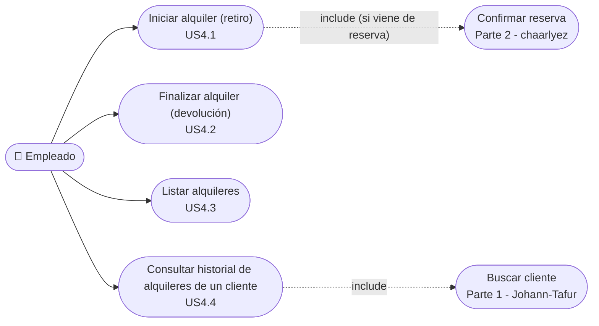
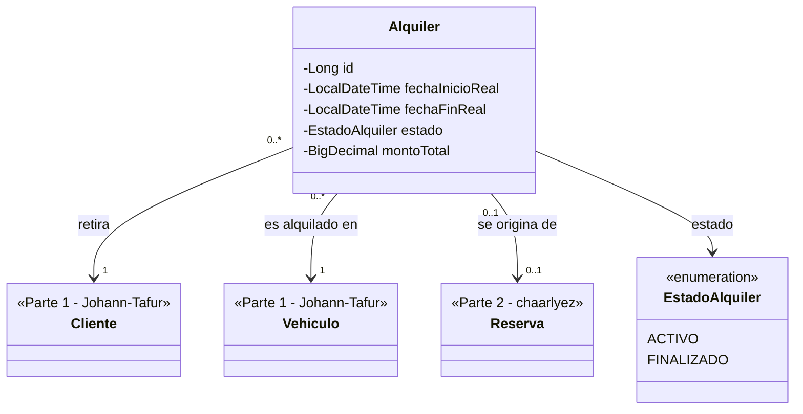
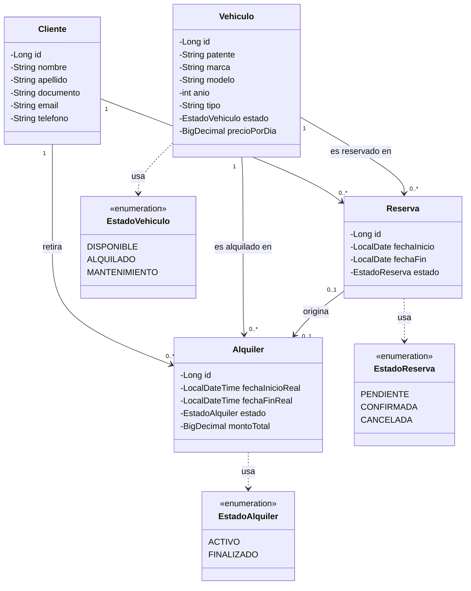
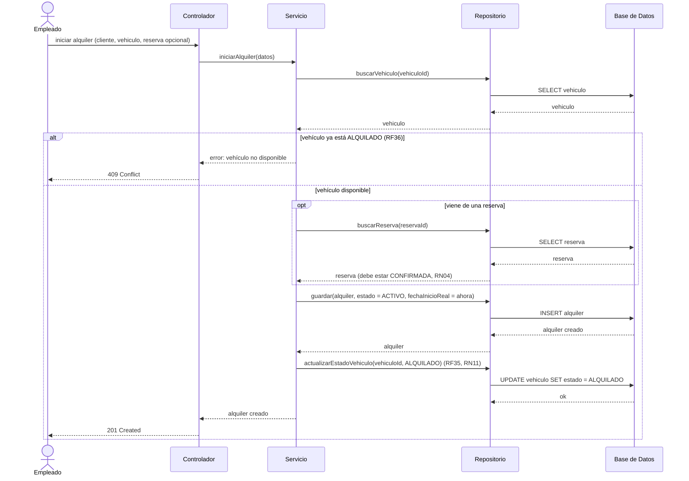
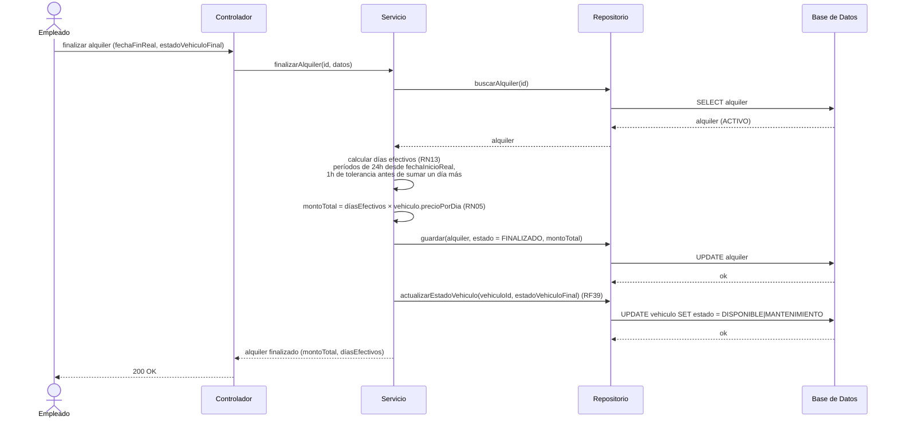
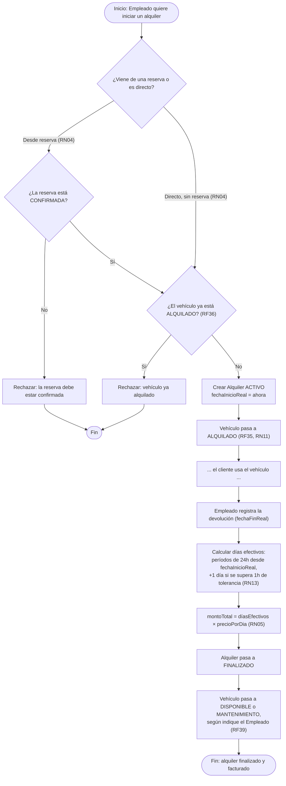
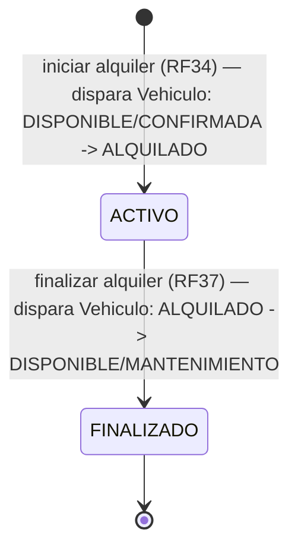

# Fase 3 — Parte 3 (mariocardona970546): Alquileres + integración final del diagrama de clases

**Alcance**: E4 — Gestión de Alquileres (`docs/01-epicas-historias-usuario.md`, historias
US4.1-US4.4), según `docs/03-uml/00-asignacion.md`. Basado en `docs/02-requerimientos.md`
(RF34-RF41, RN04, RN05, RN11, RN13, RN14).

Las clases `Vehiculo` y `Cliente` son responsabilidad de la Parte 1 (Johann-Tafur,
`01-johann-tafur-vehiculos-clientes.md`) y `Reserva` de la Parte 2 (chaarlyez,
`02-reservas-chaarlyez.md`) — acá se referencian como colaboradoras de `Alquiler`, sin redefinir
sus atributos, salvo en la sección 3 donde se integra el diagrama de clases completo (tarea que
esta parte tiene asignada además de `Alquiler`).

---

## 1. Diagrama de casos de uso

Actor **Empleado** únicamente — E4 no tiene interacción del actor Cliente (eso es E5, Parte 2).

**Relaciones `include` con otras partes**:

| Caso de uso | Incluye | Condición / regla |
|---|---|---|
| UC41 — Iniciar alquiler | UC35 (Confirmar reserva, Parte 2) | Solo si el alquiler se origina en una reserva; también puede ser directo, sin reserva previa (RN04) |
| UC44 — Consultar historial de un cliente | UC8 (Buscar cliente, Parte 1) | El historial se busca por documento del cliente, igual que UC8 (US4.4) |

---

## 2. Aporte al diagrama de clases: `Alquiler`

Notas:
- `fechaInicioReal` / `fechaFinReal` son `LocalDateTime` (con hora), no `LocalDate` — a diferencia
  de `Reserva.fechaInicio`/`fechaFin`. Es necesario para aplicar RN13 (períodos de 24h desde el
  retiro, con 1 hora de tolerancia), que exige conocer el momento exacto, no solo el día.
- La relación con `Reserva` es `0..1` de ambos lados: un Alquiler puede no tener reserva de origen
  (alquiler directo, RN04) y una Reserva puede no derivar nunca en un Alquiler (si se cancela).
- `montoTotal` es `BigDecimal` (no `double`), igual criterio que `Vehiculo.precioPorDia` (Parte 1)
  para evitar errores de redondeo en montos de dinero.

---

## 3. Integración final del diagrama de clases (las 3 partes unificadas)

Tarea propia de esta parte (ver `docs/03-uml/00-asignacion.md`): juntar los aportes de Johann-Tafur
(`Vehiculo`, `Cliente`), chaarlyez (`Reserva`) y esta parte (`Alquiler`) en un solo diagrama, sin
contradecir ninguno de los tres.

**Decisiones tomadas al integrar** (para que Johann-Tafur y chaarlyez puedan revisarlas):

| Decisión | Por qué |
|---|---|
| Se mantienen los 4 atributos de `Vehiculo` y `Cliente` exactamente como los definió la Parte 1 | No había ningún conflicto con `Alquiler` — `Vehiculo`/`Cliente` no necesitan ningún atributo nuevo por el lado de Alquileres. |
| Se mantiene `Reserva` exactamente como la definió la Parte 2 | Mismo criterio — sin conflictos. |
| `Reserva` y `Alquiler` quedan `0..1`–`0..1` (no `1`–`1`) | RF34/RN04: un alquiler puede ser directo, sin reserva; y una reserva puede cancelarse sin llegar a ser alquiler nunca. |
| Se reemplazan los placeholders `<<Parte 2 - chaarlyez>>` / `<<Parte 3 - mariocardona970546>>` de los diagramas parciales por las clases completas | Esos placeholders eran intencionales en los archivos `01-...` y `02-...` — ahí se aclara que la integración final la hace esta parte, así que no se tocan esos archivos, se integra acá. |

---

## 4. Diagramas de secuencia

### 4.1 Iniciar alquiler / retiro de vehículo (US4.1 — RF34, RF35, RF36, RN04)

### 4.2 Finalizar alquiler / devolución (US4.2 — RF37, RF38, RF39, RN05, RN13)

---

## 5. Diagramas de actividades

### 5.1 Flujo completo de un alquiler: bloqueo por alquiler activo + cálculo de días efectivos

Cubre RF34-RF39, RN04, RN05, RN11, RN13.

### 5.2 Estados de `Alquiler` (complementa el diagrama de estados de `Vehiculo` de la Parte 1)

La Parte 1 (`01-johann-tafur-vehiculos-clientes.md`, sección 4.1) dejó marcadas como
"Parte 3 - Alquileres" las transiciones de `Vehiculo` hacia/desde `ALQUILADO` — este diagrama
muestra el lado del `Alquiler` que las dispara.

---

## 6. Trazabilidad

| Diagrama | Historias | Requerimientos / Reglas |
|---|---|---|
| Casos de uso | US4.1–US4.4 | RF34–RF41 |
| Clases (`Alquiler`) | US4.1, US4.2 | RN04, RN05, RN13 |
| Integración final del diagrama de clases | — | RN04 (relación Reserva–Alquiler) |
| Secuencia — iniciar alquiler | US4.1 | RF34, RF35, RF36, RN04, RN11 |
| Secuencia — finalizar alquiler | US4.2 | RF37, RF38, RF39, RN05, RN13 |
| Actividades — flujo completo de alquiler | US4.1, US4.2 | RF34–RF39, RN04, RN05, RN11, RN13 |
| Estados de `Alquiler` | US4.1, US4.2 | RN04 |

---

## 7. Qué falta validar

- [x] ¿El diagrama de casos de uso (sección 1) cubre completo US4.1-US4.4, y las relaciones
      `include` con las Partes 1 y 2 son correctas? → **Sí.**
- [x] ¿La clase `Alquiler` (sección 2) tiene los atributos y relaciones correctos? → **Sí.**
- [x] ¿El diagrama de clases integrado (sección 3) es consistente con lo que definieron
      Johann-Tafur y chaarlyez, sin contradecir ninguna de sus dos partes? → **Sí, confirmado**
      también en `docs/03-uml/04-revision-integracion.md`.
- [x] ¿Los diagramas de secuencia (sección 4) reflejan bien RF34-RF39 y el cálculo de RN13? →
      **Sí.**
- [x] ¿El diagrama de actividades (sección 5) cubre correctamente el bloqueo por alquiler activo
      (RF36) y el cálculo de días efectivos (RN13)? → **Sí.**

**Parte 3 validada.** Con esto se cierra formalmente la **Fase 3** completa en
`docs/00-roadmap.md` y `CLAUDE.md`.
