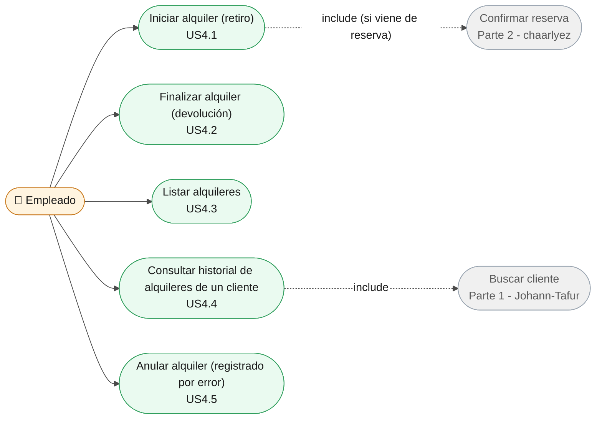
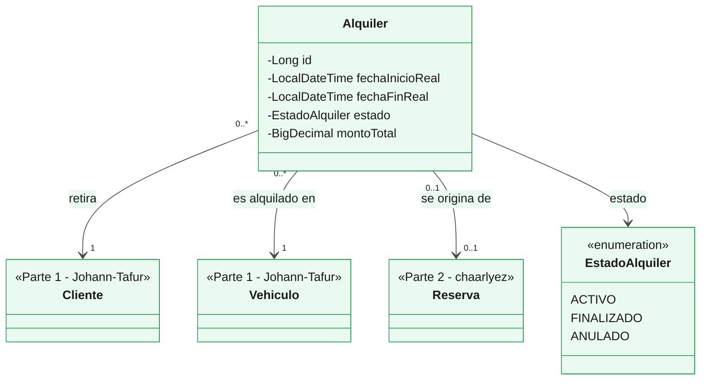
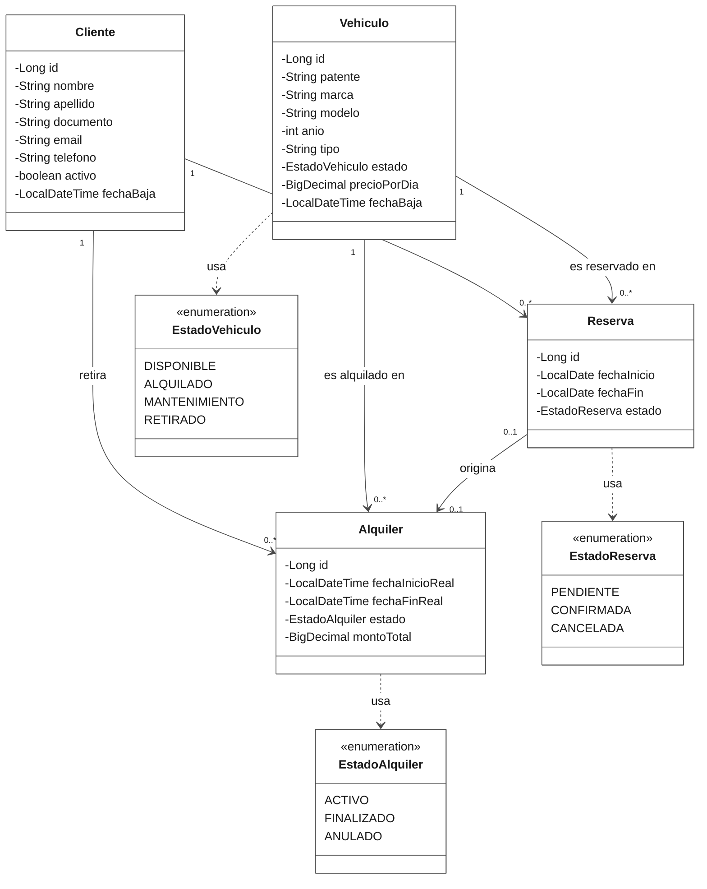
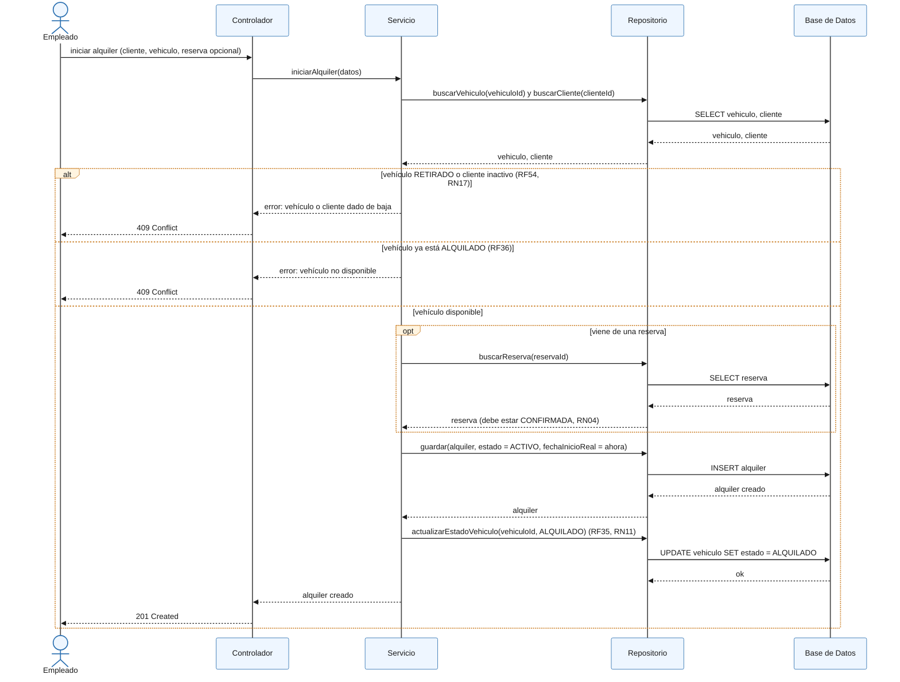
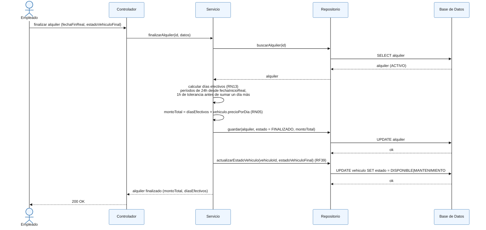
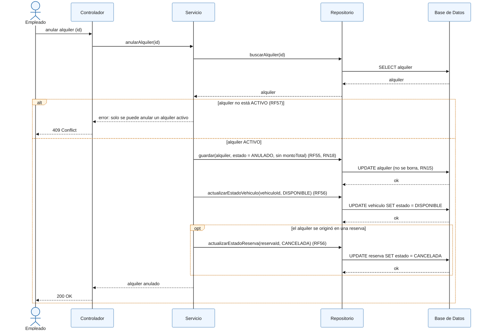
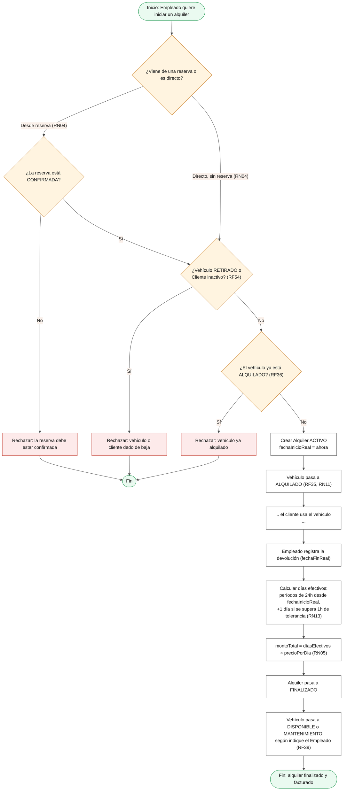
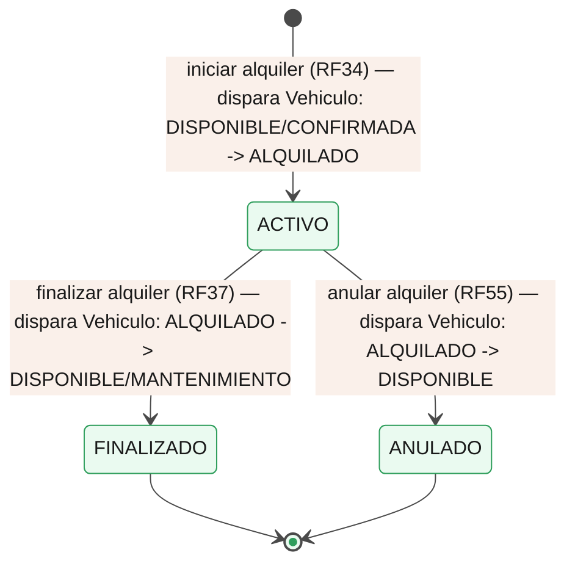

# Fase 3 — Parte 3 (mariocardona970546): Alquileres + integración final del diagrama de clases

**Alcance**: E4 — Gestión de Alquileres (`docs/01-epicas-historias-usuario.md`, historias
US4.1-US4.5), según `docs/03-uml/00-asignacion.md`. Basado en `docs/02-requerimientos.md`
(RF34-RF41, RN04, RN05, RN11, RN13, RN14; más RF54-RF57 y RN15-RN18 del cambio de borrado lógico,
`docs/cambios/01-borrado-logico.md`, que agregó US4.5).

Las clases `Vehiculo` y `Cliente` son responsabilidad de la Parte 1 (Johann-Tafur,
`01-johann-tafur-vehiculos-clientes.md`) y `Reserva` de la Parte 2 (chaarlyez,
`02-reservas-chaarlyez.md`) — acá se referencian como colaboradoras de `Alquiler`, sin redefinir
sus atributos, salvo en la sección 3 donde se integra el diagrama de clases completo (tarea que
esta parte tiene asignada además de `Alquiler`).

---

## 1. Diagrama de casos de uso

Actor **Empleado** únicamente — E4 no tiene interacción del actor Cliente (eso es E5, Parte 2).

```mermaid
%%{init: {'theme': 'base', 'themeVariables': {
  'background': '#ffffff',
  'primaryColor': '#ffffff',
  'primaryBorderColor': '#4a4a4a',
  'primaryTextColor': '#1a1a1a',
  'lineColor': '#4a4a4a',
  'textColor': '#1a1a1a'
}}}%%
flowchart LR
    Empleado(["👤 Empleado"])

    UC41(["Iniciar alquiler (retiro)<br/>US4.1"])
    UC42(["Finalizar alquiler (devolución)<br/>US4.2"])
    UC43(["Listar alquileres<br/>US4.3"])
    UC44(["Consultar historial de alquileres de un cliente<br/>US4.4"])
    UC45(["Anular alquiler (registrado por error)<br/>US4.5"])

    Empleado --> UC41
    Empleado --> UC42
    Empleado --> UC43
    Empleado --> UC44
    Empleado --> UC45

    UC41 -.->|"include (si viene de reserva)"| UC35
    UC44 -.->|include| UC8

    UC35(["Confirmar reserva<br/>Parte 2 - chaarlyez"])
    UC8(["Buscar cliente<br/>Parte 1 - Johann-Tafur"])

    classDef actor fill:#fff4e0,stroke:#c97a1e,color:#1a1a1a
    classDef usecase fill:#eafaf0,stroke:#2f9e5c,color:#1a1a1a
    classDef other fill:#f0f0f0,stroke:#9aa5b1,color:#5a5a5a
    class Empleado actor
    class UC41,UC42,UC43,UC44,UC45 usecase
    class UC35,UC8 other
```

> Fuente editable: [`fuentes/parte3-casos-de-uso-alquileres.mmd`](fuentes/parte3-casos-de-uso-alquileres.mmd)

**Relaciones `include` con otras partes**:

| Caso de uso | Incluye | Condición / regla |
|---|---|---|
| UC41 — Iniciar alquiler | UC35 (Confirmar reserva, Parte 2) | Solo si el alquiler se origina en una reserva; también puede ser directo, sin reserva previa (RN04) |
| UC44 — Consultar historial de un cliente | UC8 (Buscar cliente, Parte 1) | El historial se busca por documento del cliente, igual que UC8 (US4.4) |

---

## 2. Aporte al diagrama de clases: `Alquiler`

```mermaid
%%{init: {'theme': 'base', 'themeVariables': {
  'background': '#ffffff',
  'primaryColor': '#eafaf0',
  'primaryBorderColor': '#2f9e5c',
  'primaryTextColor': '#1a1a1a',
  'lineColor': '#4a4a4a',
  'textColor': '#1a1a1a'
}}}%%
classDiagram
    class Alquiler {
        -Long id
        -LocalDateTime fechaInicioReal
        -LocalDateTime fechaFinReal
        -EstadoAlquiler estado
        -BigDecimal montoTotal
    }

    class EstadoAlquiler {
        <<enumeration>>
        ACTIVO
        FINALIZADO
        ANULADO
    }

    class Cliente {
        <<Parte 1 - Johann-Tafur>>
    }

    class Vehiculo {
        <<Parte 1 - Johann-Tafur>>
    }

    class Reserva {
        <<Parte 2 - chaarlyez>>
    }

    Alquiler "0..*" --> "1" Cliente : retira
    Alquiler "0..*" --> "1" Vehiculo : es alquilado en
    Alquiler "0..1" --> "0..1" Reserva : se origina de
    Alquiler --> EstadoAlquiler : estado

    classDef own fill:#eafaf0,stroke:#2f9e5c,color:#1a1a1a
    classDef enum fill:#f3eaff,stroke:#7e3ff2,color:#1a1a1a
    classDef other fill:#f0f0f0,stroke:#9aa5b1,color:#5a5a5a
    class Alquiler:::own
    class EstadoAlquiler:::enum
    class Cliente:::other
    class Vehiculo:::other
    class Reserva:::other
```

> Fuente editable: [`fuentes/parte3-clases-alquiler.mmd`](fuentes/parte3-clases-alquiler.mmd)

Notas:
- `fechaInicioReal` / `fechaFinReal` son `LocalDateTime` (con hora), no `LocalDate` — a diferencia
  de `Reserva.fechaInicio`/`fechaFin`. Es necesario para aplicar RN13 (períodos de 24h desde el
  retiro, con 1 hora de tolerancia), que exige conocer el momento exacto, no solo el día.
- La relación con `Reserva` es `0..1` de ambos lados: un Alquiler puede no tener reserva de origen
  (alquiler directo, RN04) y una Reserva puede no derivar nunca en un Alquiler (si se cancela).
- `montoTotal` es `BigDecimal` (no `double`), igual criterio que `Vehiculo.precioPorDia` (Parte 1)
  para evitar errores de redondeo en montos de dinero.
- `ANULADO` es el "borrado" de un alquiler (RN15, RN18): se usa solo para un alquiler `ACTIVO`
  registrado por error. Queda sin `fechaFinReal` ni `montoTotal`, y no cuenta como alquiler activo
  para los bloqueos de RN14/RF36.

---

## 3. Integración final del diagrama de clases (las 3 partes unificadas)

Tarea propia de esta parte (ver `docs/03-uml/00-asignacion.md`): juntar los aportes de Johann-Tafur
(`Vehiculo`, `Cliente`), chaarlyez (`Reserva`) y esta parte (`Alquiler`) en un solo diagrama, sin
contradecir ninguno de los tres.

```mermaid
%%{init: {'theme': 'base', 'themeVariables': {
  'background': '#ffffff',
  'primaryColor': '#ffffff',
  'primaryBorderColor': '#4a4a4a',
  'primaryTextColor': '#1a1a1a',
  'lineColor': '#4a4a4a',
  'textColor': '#1a1a1a'
}}}%%
classDiagram
    class Vehiculo {
        -Long id
        -String patente
        -String marca
        -String modelo
        -int anio
        -String tipo
        -EstadoVehiculo estado
        -BigDecimal precioPorDia
        -LocalDateTime fechaBaja
    }

    class Cliente {
        -Long id
        -String nombre
        -String apellido
        -String documento
        -String email
        -String telefono
        -boolean activo
        -LocalDateTime fechaBaja
    }

    class Reserva {
        -Long id
        -LocalDate fechaInicio
        -LocalDate fechaFin
        -EstadoReserva estado
    }

    class Alquiler {
        -Long id
        -LocalDateTime fechaInicioReal
        -LocalDateTime fechaFinReal
        -EstadoAlquiler estado
        -BigDecimal montoTotal
    }

    class EstadoVehiculo {
        <<enumeration>>
        DISPONIBLE
        ALQUILADO
        MANTENIMIENTO
        RETIRADO
    }

    class EstadoReserva {
        <<enumeration>>
        PENDIENTE
        CONFIRMADA
        CANCELADA
    }

    class EstadoAlquiler {
        <<enumeration>>
        ACTIVO
        FINALIZADO
        ANULADO
    }

    Cliente "1" --> "0..*" Reserva : realiza
    Vehiculo "1" --> "0..*" Reserva : es reservado en
    Cliente "1" --> "0..*" Alquiler : retira
    Vehiculo "1" --> "0..*" Alquiler : es alquilado en
    Reserva "0..1" --> "0..1" Alquiler : origina
    Vehiculo ..> EstadoVehiculo : usa
    Reserva ..> EstadoReserva : usa
    Alquiler ..> EstadoAlquiler : usa

    classDef parte1 fill:#eef6ff,stroke:#2a6fb0,color:#1a1a1a
    classDef parte2 fill:#fff4e0,stroke:#c97a1e,color:#1a1a1a
    classDef parte3 fill:#eafaf0,stroke:#2f9e5c,color:#1a1a1a
    classDef enum fill:#f3eaff,stroke:#7e3ff2,color:#1a1a1a
    class Vehiculo:::parte1
    class Cliente:::parte1
    class Reserva:::parte2
    class Alquiler:::parte3
    class EstadoVehiculo:::enum
    class EstadoReserva:::enum
    class EstadoAlquiler:::enum
```

> Fuente editable: [`fuentes/parte3-clases-integracion-final.mmd`](fuentes/parte3-clases-integracion-final.mmd)

**Decisiones tomadas al integrar** (para que Johann-Tafur y chaarlyez puedan revisarlas):

| Decisión | Por qué |
|---|---|
| Se mantienen los 4 atributos de `Vehiculo` y `Cliente` exactamente como los definió la Parte 1 | No había ningún conflicto con `Alquiler` — `Vehiculo`/`Cliente` no necesitan ningún atributo nuevo por el lado de Alquileres. |
| Se mantiene `Reserva` exactamente como la definió la Parte 2 | Mismo criterio — sin conflictos. |
| *(Cambio posterior)* `Vehiculo` y `Cliente` suman `fechaBaja`, `Cliente` suma `activo`, `EstadoVehiculo` suma `RETIRADO` y `EstadoAlquiler` suma `ANULADO` | Borrado lógico (RN15, `docs/cambios/01-borrado-logico.md`): ningún registro se borra; se copian acá los mismos atributos que agregó la Parte 1, para que el diagrama integrado siga siendo igual a la suma de las tres partes. |
| `Reserva` y `Alquiler` quedan `0..1`–`0..1` (no `1`–`1`) | RF34/RN04: un alquiler puede ser directo, sin reserva; y una reserva puede cancelarse sin llegar a ser alquiler nunca. |
| Se reemplazan los placeholders `<<Parte 2 - chaarlyez>>` / `<<Parte 3 - mariocardona970546>>` de los diagramas parciales por las clases completas | Esos placeholders eran intencionales en los archivos `01-...` y `02-...` — ahí se aclara que la integración final la hace esta parte, así que no se tocan esos archivos, se integra acá. |

---

## 4. Diagramas de secuencia

### 4.1 Iniciar alquiler / retiro de vehículo (US4.1 — RF34, RF35, RF36, RF54, RN04)

```mermaid
%%{init: {'theme': 'base', 'themeVariables': {
  'background': '#ffffff',
  'actorBkg': '#eef6ff',
  'actorBorder': '#2a6fb0',
  'actorTextColor': '#1a1a1a',
  'actorLineColor': '#4a4a4a',
  'signalColor': '#1a1a1a',
  'signalTextColor': '#1a1a1a',
  'labelBoxBkgColor': '#fff4e0',
  'labelBoxBorderColor': '#c97a1e',
  'labelTextColor': '#1a1a1a',
  'loopTextColor': '#1a1a1a',
  'noteBkgColor': '#fff9c4',
  'noteBorderColor': '#c9a400',
  'noteTextColor': '#1a1a1a',
  'activationBorderColor': '#2a6fb0',
  'activationBkgColor': '#eafaf0',
  'sequenceNumberColor': '#1a1a1a'
}}}%%
sequenceDiagram
    actor Empleado
    participant Controlador
    participant Servicio
    participant Repositorio
    participant BaseDeDatos as Base de Datos

    Empleado->>Controlador: iniciar alquiler (cliente, vehiculo, reserva opcional)
    Controlador->>Servicio: iniciarAlquiler(datos)
    Servicio->>Repositorio: buscarVehiculo(vehiculoId) y buscarCliente(clienteId)
    Repositorio->>BaseDeDatos: SELECT vehiculo, cliente
    BaseDeDatos-->>Repositorio: vehiculo, cliente
    Repositorio-->>Servicio: vehiculo, cliente

    alt vehículo RETIRADO o cliente inactivo (RF54, RN17)
        Servicio-->>Controlador: error: vehículo o cliente dado de baja
        Controlador-->>Empleado: 409 Conflict
    else vehículo ya está ALQUILADO (RF36)
        Servicio-->>Controlador: error: vehículo no disponible
        Controlador-->>Empleado: 409 Conflict
    else vehículo disponible
        opt viene de una reserva
            Servicio->>Repositorio: buscarReserva(reservaId)
            Repositorio->>BaseDeDatos: SELECT reserva
            BaseDeDatos-->>Repositorio: reserva
            Repositorio-->>Servicio: reserva (debe estar CONFIRMADA, RN04)
        end
        Servicio->>Repositorio: guardar(alquiler, estado = ACTIVO, fechaInicioReal = ahora)
        Repositorio->>BaseDeDatos: INSERT alquiler
        BaseDeDatos-->>Repositorio: alquiler creado
        Repositorio-->>Servicio: alquiler
        Servicio->>Repositorio: actualizarEstadoVehiculo(vehiculoId, ALQUILADO) (RF35, RN11)
        Repositorio->>BaseDeDatos: UPDATE vehiculo SET estado = ALQUILADO
        BaseDeDatos-->>Repositorio: ok
        Servicio-->>Controlador: alquiler creado
        Controlador-->>Empleado: 201 Created
    end
```

> Fuente editable: [`fuentes/parte3-secuencia-iniciar-alquiler.mmd`](fuentes/parte3-secuencia-iniciar-alquiler.mmd)

### 4.2 Finalizar alquiler / devolución (US4.2 — RF37, RF38, RF39, RN05, RN13)

```mermaid
%%{init: {'theme': 'base', 'themeVariables': {
  'background': '#ffffff',
  'actorBkg': '#eef6ff',
  'actorBorder': '#2a6fb0',
  'actorTextColor': '#1a1a1a',
  'actorLineColor': '#4a4a4a',
  'signalColor': '#1a1a1a',
  'signalTextColor': '#1a1a1a',
  'labelBoxBkgColor': '#fff4e0',
  'labelBoxBorderColor': '#c97a1e',
  'labelTextColor': '#1a1a1a',
  'loopTextColor': '#1a1a1a',
  'noteBkgColor': '#fff9c4',
  'noteBorderColor': '#c9a400',
  'noteTextColor': '#1a1a1a',
  'activationBorderColor': '#2a6fb0',
  'activationBkgColor': '#eafaf0',
  'sequenceNumberColor': '#1a1a1a'
}}}%%
sequenceDiagram
    actor Empleado
    participant Controlador
    participant Servicio
    participant Repositorio
    participant BaseDeDatos as Base de Datos

    Empleado->>Controlador: finalizar alquiler (fechaFinReal, estadoVehiculoFinal)
    Controlador->>Servicio: finalizarAlquiler(id, datos)
    Servicio->>Repositorio: buscarAlquiler(id)
    Repositorio->>BaseDeDatos: SELECT alquiler
    BaseDeDatos-->>Repositorio: alquiler (ACTIVO)
    Repositorio-->>Servicio: alquiler

    Servicio->>Servicio: calcular días efectivos (RN13)<br/>períodos de 24h desde fechaInicioReal,<br/>1h de tolerancia antes de sumar un día más
    Servicio->>Servicio: montoTotal = díasEfectivos × vehiculo.precioPorDia (RN05)

    Servicio->>Repositorio: guardar(alquiler, estado = FINALIZADO, montoTotal)
    Repositorio->>BaseDeDatos: UPDATE alquiler
    BaseDeDatos-->>Repositorio: ok
    Servicio->>Repositorio: actualizarEstadoVehiculo(vehiculoId, estadoVehiculoFinal) (RF39)
    Repositorio->>BaseDeDatos: UPDATE vehiculo SET estado = DISPONIBLE|MANTENIMIENTO
    BaseDeDatos-->>Repositorio: ok
    Servicio-->>Controlador: alquiler finalizado (montoTotal, díasEfectivos)
    Controlador-->>Empleado: 200 OK
```

> Fuente editable: [`fuentes/parte3-secuencia-finalizar-alquiler.mmd`](fuentes/parte3-secuencia-finalizar-alquiler.mmd)

### 4.3 Anular alquiler registrado por error (US4.5 — RF55, RF56, RF57, RN15, RN18)

```mermaid
%%{init: {'theme': 'base', 'themeVariables': {
  'background': '#ffffff',
  'actorBkg': '#eef6ff',
  'actorBorder': '#2a6fb0',
  'actorTextColor': '#1a1a1a',
  'actorLineColor': '#4a4a4a',
  'signalColor': '#1a1a1a',
  'signalTextColor': '#1a1a1a',
  'labelBoxBkgColor': '#fff4e0',
  'labelBoxBorderColor': '#c97a1e',
  'labelTextColor': '#1a1a1a',
  'loopTextColor': '#1a1a1a',
  'noteBkgColor': '#fff9c4',
  'noteBorderColor': '#c9a400',
  'noteTextColor': '#1a1a1a',
  'activationBorderColor': '#2a6fb0',
  'activationBkgColor': '#eafaf0',
  'sequenceNumberColor': '#1a1a1a'
}}}%%
sequenceDiagram
    actor Empleado
    participant Controlador
    participant Servicio
    participant Repositorio
    participant BaseDeDatos as Base de Datos

    Empleado->>Controlador: anular alquiler (id)
    Controlador->>Servicio: anularAlquiler(id)
    Servicio->>Repositorio: buscarAlquiler(id)
    Repositorio->>BaseDeDatos: SELECT alquiler
    BaseDeDatos-->>Repositorio: alquiler
    Repositorio-->>Servicio: alquiler

    alt alquiler no está ACTIVO (RF57)
        Servicio-->>Controlador: error: solo se puede anular un alquiler activo
        Controlador-->>Empleado: 409 Conflict
    else alquiler ACTIVO
        Servicio->>Repositorio: guardar(alquiler, estado = ANULADO, sin montoTotal) (RF55, RN18)
        Repositorio->>BaseDeDatos: UPDATE alquiler (no se borra, RN15)
        BaseDeDatos-->>Repositorio: ok
        Servicio->>Repositorio: actualizarEstadoVehiculo(vehiculoId, DISPONIBLE) (RF56)
        Repositorio->>BaseDeDatos: UPDATE vehiculo SET estado = DISPONIBLE
        BaseDeDatos-->>Repositorio: ok
        opt el alquiler se originó en una reserva
            Servicio->>Repositorio: actualizarEstadoReserva(reservaId, CANCELADA) (RF56)
            Repositorio->>BaseDeDatos: UPDATE reserva SET estado = CANCELADA
            BaseDeDatos-->>Repositorio: ok
        end
        Servicio-->>Controlador: alquiler anulado
        Controlador-->>Empleado: 200 OK
    end
```

> Fuente editable: [`fuentes/parte3-secuencia-anular-alquiler.mmd`](fuentes/parte3-secuencia-anular-alquiler.mmd)

---

## 5. Diagramas de actividades

### 5.1 Flujo completo de un alquiler: bloqueo por alquiler activo + cálculo de días efectivos

Cubre RF34-RF39, RF54, RN04, RN05, RN11, RN13, RN17.

```mermaid
%%{init: {'theme': 'base', 'themeVariables': {
  'background': '#ffffff',
  'primaryColor': '#eafaf0',
  'primaryBorderColor': '#2f9e5c',
  'primaryTextColor': '#1a1a1a',
  'lineColor': '#4a4a4a',
  'textColor': '#1a1a1a'
}}}%%
flowchart TD
    Start(["Inicio: Empleado quiere iniciar un alquiler"]) --> Origen{"¿Viene de una reserva o es directo?"}
    Origen -- "Desde reserva (RN04)" --> ValReserva{"¿La reserva está CONFIRMADA?"}
    ValReserva -- No --> R1["Rechazar: la reserva debe estar confirmada"]
    R1 --> Fin1(["Fin"])
    ValReserva -- Sí --> ValVehiculo
    Origen -- "Directo, sin reserva (RN04)" --> ValVehiculo

    ValVehiculo{"¿Vehículo RETIRADO o<br/>Cliente inactivo? (RF54)"}
    ValVehiculo -- Sí --> R3["Rechazar: vehículo o cliente dado de baja"]
    R3 --> Fin1
    ValVehiculo -- No --> ValAlquilado{"¿El vehículo ya está ALQUILADO? (RF36)"}
    ValAlquilado -- Sí --> R2["Rechazar: vehículo ya alquilado"]
    R2 --> Fin1

    ValAlquilado -- No --> Crear["Crear Alquiler ACTIVO<br/>fechaInicioReal = ahora"]
    Crear --> Ocupar["Vehículo pasa a ALQUILADO (RF35, RN11)"]
    Ocupar --> Uso["... el cliente usa el vehículo ..."]
    Uso --> Devolucion["Empleado registra la devolución (fechaFinReal)"]
    Devolucion --> Calcular["Calcular días efectivos:<br/>períodos de 24h desde fechaInicioReal,<br/>+1 día si se supera 1h de tolerancia (RN13)"]
    Calcular --> Monto["montoTotal = díasEfectivos × precioPorDia (RN05)"]
    Monto --> Finalizar["Alquiler pasa a FINALIZADO"]
    Finalizar --> EstadoFinal["Vehículo pasa a DISPONIBLE o MANTENIMIENTO,<br/>según indique el Empleado (RF39)"]
    EstadoFinal --> Fin2(["Fin: alquiler finalizado y facturado"])

    classDef startEnd fill:#eafaf0,stroke:#2f9e5c,color:#1a1a1a
    classDef decision fill:#fff4e0,stroke:#c97a1e,color:#1a1a1a
    classDef action fill:#ffffff,stroke:#4a4a4a,color:#1a1a1a
    classDef reject fill:#fdeaea,stroke:#c0392b,color:#1a1a1a
    class Start,Fin1,Fin2 startEnd
    class Origen,ValReserva,ValVehiculo,ValAlquilado decision
    class Crear,Ocupar,Uso,Devolucion,Calcular,Monto,Finalizar,EstadoFinal action
    class R1,R2,R3 reject
```

> Fuente editable: [`fuentes/parte3-actividades-flujo-alquiler.mmd`](fuentes/parte3-actividades-flujo-alquiler.mmd)

### 5.2 Estados de `Alquiler` (complementa el diagrama de estados de `Vehiculo` de la Parte 1)

La Parte 1 (`01-johann-tafur-vehiculos-clientes.md`, sección 4.1) dejó marcadas como
"Parte 3 - Alquileres" las transiciones de `Vehiculo` hacia/desde `ALQUILADO` — este diagrama
muestra el lado del `Alquiler` que las dispara.

```mermaid
%%{init: {'theme': 'base', 'themeVariables': {
  'background': '#ffffff',
  'primaryColor': '#eafaf0',
  'primaryBorderColor': '#2f9e5c',
  'primaryTextColor': '#1a1a1a',
  'lineColor': '#4a4a4a',
  'textColor': '#1a1a1a'
}}}%%
stateDiagram-v2
    [*] --> ACTIVO : iniciar alquiler (RF34) — dispara Vehiculo: DISPONIBLE/CONFIRMADA -> ALQUILADO
    ACTIVO --> FINALIZADO : finalizar alquiler (RF37) — dispara Vehiculo: ALQUILADO -> DISPONIBLE/MANTENIMIENTO
    ACTIVO --> ANULADO : anular alquiler (RF55) — dispara Vehiculo: ALQUILADO -> DISPONIBLE
    FINALIZADO --> [*]
    ANULADO --> [*]

    classDef active fill:#eafaf0,stroke:#2f9e5c,color:#1a1a1a
    classDef done fill:#eef6ff,stroke:#2a6fb0,color:#1a1a1a
    classDef voided fill:#f0f0f0,stroke:#9aa5b1,color:#5a5a5a
    class ACTIVO:::active
    class FINALIZADO:::done
    class ANULADO:::voided
```

> Fuente editable: [`fuentes/parte3-estados-alquiler.mmd`](fuentes/parte3-estados-alquiler.mmd)

---

## 6. Trazabilidad

| Diagrama | Historias | Requerimientos / Reglas |
|---|---|---|
| Casos de uso | US4.1–US4.5 | RF34–RF41, RF54–RF57 |
| Clases (`Alquiler`) | US4.1, US4.2, US4.5 | RN04, RN05, RN13, RN18 |
| Integración final del diagrama de clases | — | RN04 (relación Reserva–Alquiler), RN15 (borrado lógico) |
| Secuencia — iniciar alquiler | US4.1 | RF34, RF35, RF36, RF54, RN04, RN11 |
| Secuencia — finalizar alquiler | US4.2 | RF37, RF38, RF39, RN05, RN13 |
| Secuencia — anular alquiler | US4.5 | RF55, RF56, RF57, RN15, RN18 |
| Actividades — flujo completo de alquiler | US4.1, US4.2 | RF34–RF39, RF54, RN04, RN05, RN11, RN13 |
| Estados de `Alquiler` | US4.1, US4.2, US4.5 | RN04, RN18 |

---

## 7. Qué falta validar

- [x] ¿El diagrama de casos de uso (sección 1) cubre completo US4.1-US4.4, y las relaciones
      `include` con las Partes 1 y 2 son correctas? → **Sí.**
- [x] ¿La clase `Alquiler` (sección 2) tiene los atributos y relaciones correctos? → **Sí.**
- [x] ¿El diagrama de clases integrado (sección 3) es consistente con lo que definieron
      Johann-Tafur y chaarlyez, sin contradecir ninguna de sus dos partes? → **Sí, confirmado**
      también en `docs/03-uml/04-revision-integracion.md`.
- [x] ¿Los diagramas de secuencia (sección 4) reflejan bien RF34-RF39 y el cálculo de RN13? →
      **Sí.**
- [x] ¿El diagrama de actividades (sección 5) cubre correctamente el bloqueo por alquiler activo
      (RF36) y el cálculo de días efectivos (RN13)? → **Sí.**

- [ ] ¿Los ajustes del borrado lógico (US4.5 anular alquiler, estado `ANULADO`, atributos de baja
      en la integración final) son correctos? → **Pendiente de validar** (ver
      `docs/cambios/01-borrado-logico.md`).

**Parte 3 validada.** Con esto se cierra formalmente la **Fase 3** completa en
`docs/00-roadmap.md` y `CLAUDE.md`.
