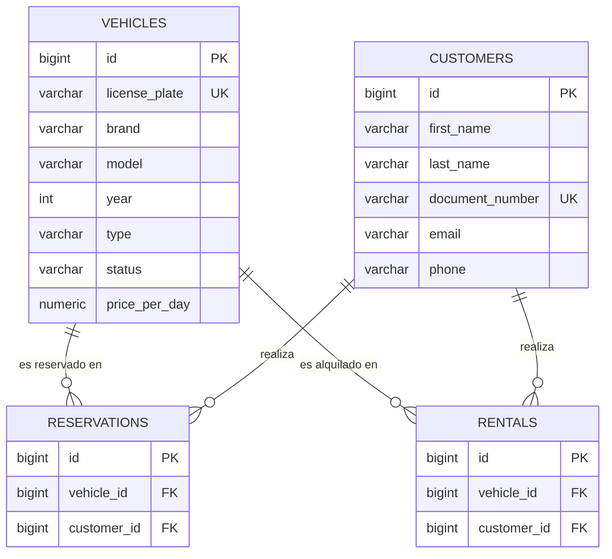

# Fase 4 — Parte 1 (Johann-Tafur): tablas `vehicles` y `customers`

**Alcance**: tablas `vehicles` y `customers`, a partir de las clases `Vehiculo`/`Cliente` modeladas
en `docs/03-uml/01-johann-tafur-vehiculos-clientes.md` y de los requerimientos RF01-RF24, RN01,
RN06, RN07, RN08 de `docs/02-requerimientos.md`.

Las tablas `reservations` y `rentals` son responsabilidad de las Partes 2 y 3
(`02-reservas-chaarlyez.md`, pendiente `03-alquileres-mariocardona970546.md`) — acá se referencian
solo como placeholders (solo su PK), sin redefinir sus columnas. El orden de creación de las 4
tablas del sistema es `vehicles`, `customers` → `reservations` → `rentals`, por las dependencias de
FK — por eso estas dos tablas no tienen ninguna FK saliente, son el lado "1" de las relaciones.

---

## 1. Modelo lógico

### 1.1 `vehicles`

| Columna | Tipo | Restricciones | Corresponde a |
|---|---|---|---|
| `id` | `BIGSERIAL` | `PRIMARY KEY` | `Vehiculo.id` |
| `license_plate` | `VARCHAR(10)` | `NOT NULL`, `UNIQUE` | `Vehiculo.patente` |
| `brand` | `VARCHAR(50)` | `NOT NULL` | `Vehiculo.marca` |
| `model` | `VARCHAR(50)` | `NOT NULL` | `Vehiculo.modelo` |
| `year` | `INT` | `NOT NULL` | `Vehiculo.anio` |
| `type` | `VARCHAR(30)` | `NOT NULL` | `Vehiculo.tipo` |
| `status` | `VARCHAR(20)` | `NOT NULL DEFAULT 'AVAILABLE'`, `CHECK (status IN ('AVAILABLE','RENTED','MAINTENANCE'))` | `Vehiculo.estado` (`EstadoVehiculo`) |
| `price_per_day` | `NUMERIC(10,2)` | `NOT NULL` | `Vehiculo.precioPorDia` |

### 1.2 `customers`

| Columna | Tipo | Restricciones | Corresponde a |
|---|---|---|---|
| `id` | `BIGSERIAL` | `PRIMARY KEY` | `Cliente.id` |
| `first_name` | `VARCHAR(50)` | `NOT NULL` | `Cliente.nombre` |
| `last_name` | `VARCHAR(50)` | `NOT NULL` | `Cliente.apellido` |
| `document_number` | `VARCHAR(20)` | `NOT NULL`, `UNIQUE` | `Cliente.documento` |
| `email` | `VARCHAR(100)` | — | `Cliente.email` |
| `phone` | `VARCHAR(20)` | — | `Cliente.telefono` |

Notas de diseño:
- `type` (`vehicles`) queda como texto libre, no como `CHECK` cerrado: el Anexo de precios de
  referencia (`docs/02-requerimientos.md` sección 8) usa categorías (Económico, SUV mediano, etc.)
  solo a modo orientativo para precios, ningún requerimiento define un dominio cerrado de tipos —
  cerrarlo ahora sería agregar una restricción que nadie pidió.
- `status` sí se cierra con `CHECK`, igual criterio que `reservations.status`
  (`02-reservas-chaarlyez.md`): `VARCHAR` + `CHECK` en vez de `ENUM` nativo de PostgreSQL, para no
  depender de `ALTER TYPE` si se agrega un estado más adelante. Nace en `AVAILABLE` (RF04).
- `email` y `phone` no llevan `NOT NULL`: RF17 solo exige nombre, apellido y documento — mismo
  criterio que la Parte 2, que tampoco agrega restricciones no pedidas por los requerimientos. El
  formulario público (E5, RF45) exige "datos básicos obligatorios" a nivel de negocio, pero eso se
  valida en la capa de servicio en la Fase 6 (Bean Validation), no en el esquema.
- Ni `price_per_day` ni ningún otro campo llevan validación de formato (positivo, regex de email,
  etc.) a nivel de esquema — se deja para Bean Validation en la Fase 6 (`CLAUDE.md` sección 6), no
  se duplica la validación en dos capas.
- Sin columnas de auditoría (`created_at`, etc.): ningún requerimiento las pide.

## 2. Script SQL

```sql
CREATE TABLE vehicles (
    id             BIGSERIAL PRIMARY KEY,
    license_plate  VARCHAR(10) NOT NULL UNIQUE,
    brand          VARCHAR(50) NOT NULL,
    model          VARCHAR(50) NOT NULL,
    year           INT NOT NULL,
    type           VARCHAR(30) NOT NULL,
    status         VARCHAR(20) NOT NULL DEFAULT 'AVAILABLE'
                   CHECK (status IN ('AVAILABLE', 'RENTED', 'MAINTENANCE')),
    price_per_day  NUMERIC(10,2) NOT NULL
);

-- Acelera el filtrado por estado (US1.2/RF06) y la búsqueda de disponibilidad (US1.5/RF12)
CREATE INDEX idx_vehicles_status ON vehicles (status);

CREATE TABLE customers (
    id               BIGSERIAL PRIMARY KEY,
    first_name       VARCHAR(50) NOT NULL,
    last_name        VARCHAR(50) NOT NULL,
    document_number  VARCHAR(20) NOT NULL UNIQUE,
    email            VARCHAR(100),
    phone            VARCHAR(20)
);

-- Acelera la búsqueda de clientes por apellido (US2.2/RF20), que puede devolver varios resultados
CREATE INDEX idx_customers_last_name ON customers (last_name);
```

`UNIQUE` en `license_plate` cubre RF03/RN07; `UNIQUE` en `document_number` cubre RF18/RN06 (ambos
ya crean su propio índice en PostgreSQL, por eso no hace falta uno adicional para la búsqueda por
documento de US2.2/RF19).

## 3. Diagrama entidad-relación (porción de esta parte)



`RESERVATIONS` y `RENTALS` se muestran solo con sus FKs hacia estas dos tablas, como placeholder —
sus columnas completas están en `02-reservas-chaarlyez.md` y en la futura
`03-alquileres-mariocardona970546.md`. El script SQL completo y el diagrama ER final los integra la
Parte 3, igual mecánica que la Fase 3.

## 4. Trazabilidad

| Elemento | Requerimientos / Reglas |
|---|---|
| Columnas y tipos de `vehicles` | RF01 |
| `UNIQUE(license_plate)` | RF03, RN07 |
| `status DEFAULT 'AVAILABLE'` | RF04 |
| `CHECK` de `status` (3 valores) | RN01 |
| Índice `idx_vehicles_status` | RF06, RF12 |
| Columnas y tipos de `customers` | RF16 |
| `UNIQUE(document_number)` | RF18, RN06 |
| Índice `idx_customers_last_name` | RF20 |
| `email`/`phone` opcionales a nivel de esquema | RF17 |
| Baja/eliminación bloqueada con actividad (regla de negocio, no de esquema) | RF11, RF24, RN08 |

---

## 5. Qué falta validar

- [x] ¿Las columnas y tipos de `vehicles` y `customers` (sección 1) son correctos y suficientes
      para RF01 y RF16? → **Sí.**
- [x] ¿Los `UNIQUE` de `license_plate` y `document_number` (sección 2) reflejan bien RN07 y RN06? →
      **Sí.**
- [x] ¿El `CHECK` de `status` y su valor por defecto reflejan bien RN01 y RF04? → **Sí.**
- [x] ¿Dejar `type` como texto libre en vez de un `CHECK` cerrado es correcto, dado que ningún
      requerimiento define un dominio fijo de tipos de vehículo? → **Sí**, ver nota de diseño en la
      sección 1.
- [ ] ¿Las FKs entrantes desde `reservations` y `rentals` (sección 3) son consistentes con lo que
      ya entregó la Parte 2 y lo que entregue la Parte 3? → pendiente hasta que mariocardona970546
      suba su parte; se confirma en la revisión de coherencia final entre las 3 partes.

**Contenido propio validado.** Queda pendiente solo la revisión de coherencia cruzada con la
Parte 3 una vez que esté entregada (mismo criterio que la Fase 3, ver
`docs/03-uml/04-revision-integracion.md`).
