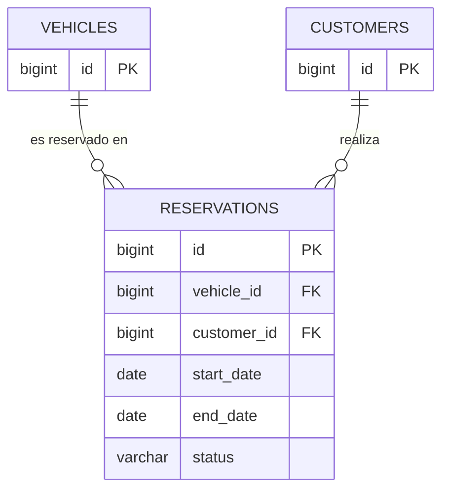

# Fase 4 — Parte 2 (chaarlyez): tabla `reservations`

**Alcance**: tabla `reservations`, a partir de la clase `Reserva` modelada en
`docs/03-uml/02-reservas-chaarlyez.md` y de los requerimientos RF25-RF33, RF45, RN02, RN04, RN09,
RN12, RN14 de `docs/02-requerimientos.md`.

Las tablas `vehicles` y `customers` son responsabilidad de la Parte 1 (Johann-Tafur,
`01-johann-tafur-vehiculos-clientes.md`) — acá se referencian solo como tablas colaboradoras
(claves foráneas), sin redefinir sus columnas. El orden de creación de las 4 tablas del sistema es
`vehicles`, `customers` → `reservations` → `rentals`, por las dependencias de FK.

---

## 1. Modelo lógico

| Columna | Tipo | Restricciones | Corresponde a |
|---|---|---|---|
| `id` | `BIGSERIAL` | `PRIMARY KEY` | `Reserva.id` |
| `vehicle_id` | `BIGINT` | `NOT NULL`, `REFERENCES vehicles(id)` | relación `Vehiculo 1 — 0..* Reserva` |
| `customer_id` | `BIGINT` | `NOT NULL`, `REFERENCES customers(id)` | relación `Cliente 1 — 0..* Reserva` |
| `start_date` | `DATE` | `NOT NULL` | `Reserva.fechaInicio` |
| `end_date` | `DATE` | `NOT NULL` | `Reserva.fechaFin` |
| `status` | `VARCHAR(20)` | `NOT NULL DEFAULT 'PENDING'`, `CHECK (status IN ('PENDING','CONFIRMED','CANCELLED'))` | `Reserva.estado` (`EstadoReserva`) |

Notas de diseño:
- `start_date`/`end_date` son `DATE` (sin hora) porque RN12 define el solapamiento con
  granularidad de día, no de hora — a diferencia de `rentals`, que sí necesita hora (RN13).
- `status` se modela como `VARCHAR` + `CHECK`, no como tipo `ENUM` nativo de PostgreSQL, para
  evitar la complejidad de `ALTER TYPE` si se agrega un estado más adelante — mismo criterio de
  simplicidad junior que el resto del proyecto (ver `CLAUDE.md` sección 1). Por defecto nace en
  `PENDING` (RN09).
- No se agregan columnas de auditoría (`created_at`, etc.) porque ningún requerimiento las pide —
  no hay que anticipar necesidades fuera del MVP.
- La validación de solapamiento (RN02/RN12) y el bloqueo por alquiler activo (RN14) son reglas de
  **negocio**, no restricciones que la base de datos pueda expresar con un `CHECK` simple (dependen
  de comparar contra otras filas). Se implementan en la capa de servicio en la Fase 6; acá solo se
  deja el índice que las hace eficientes (ver sección 2).

## 2. Script SQL

```sql
CREATE TABLE reservations (
    id            BIGSERIAL PRIMARY KEY,
    vehicle_id    BIGINT NOT NULL REFERENCES vehicles(id),
    customer_id   BIGINT NOT NULL REFERENCES customers(id),
    start_date    DATE NOT NULL,
    end_date      DATE NOT NULL,
    status        VARCHAR(20) NOT NULL DEFAULT 'PENDING'
                  CHECK (status IN ('PENDING', 'CONFIRMED', 'CANCELLED')),
    CONSTRAINT chk_reservations_dates CHECK (end_date > start_date)
);

-- Acelera la búsqueda de solapamiento (RN02/RN12): "¿hay otra reserva PENDING/CONFIRMED
-- de este vehículo cuyo rango se cruce con el pedido?"
CREATE INDEX idx_reservations_vehicle_dates ON reservations (vehicle_id, start_date, end_date);
```

`chk_reservations_dates` cubre RF26 (`end_date` posterior a `start_date`, estrictamente mayor).

## 3. Diagrama entidad-relación (porción de esta parte)



`VEHICLES` y `CUSTOMERS` se muestran solo con su PK como placeholder — sus columnas completas están
en `01-johann-tafur-vehiculos-clientes.md`. La relación `RESERVATIONS 0..1 — 0..1 RENTALS` (RN04)
queda para la integración final de la Parte 3.

## 4. Trazabilidad

| Elemento | Requerimientos / Reglas |
|---|---|
| Columnas y tipos | RF25 |
| `chk_reservations_dates` | RF26 |
| FKs `vehicle_id`, `customer_id` | RF27 |
| Índice de solapamiento | RF13, RF28, RN02, RN12 |
| `status DEFAULT 'PENDING'` | RN09 |
| Bloqueo por alquiler activo (regla de negocio, no de esquema) | RF13, RF28, RN14 |
| Reserva pública (mismas validaciones) | RF45 |

---

## 5. Qué falta validar

- [ ] ¿Las columnas y tipos de `reservations` (sección 1) son correctos y suficientes para RF25?
- [ ] ¿El `CHECK` de fechas y el `DEFAULT` de `status` (sección 2) reflejan bien RF26 y RN09?
- [ ] ¿El índice sobre `(vehicle_id, start_date, end_date)` es el adecuado para soportar
      eficientemente la validación de solapamiento de RN12?
- [ ] ¿Las FKs a `vehicles` y `customers` (sección 3) son consistentes con lo que entregue la
      Parte 1?

Pendiente de validar con el usuario.
