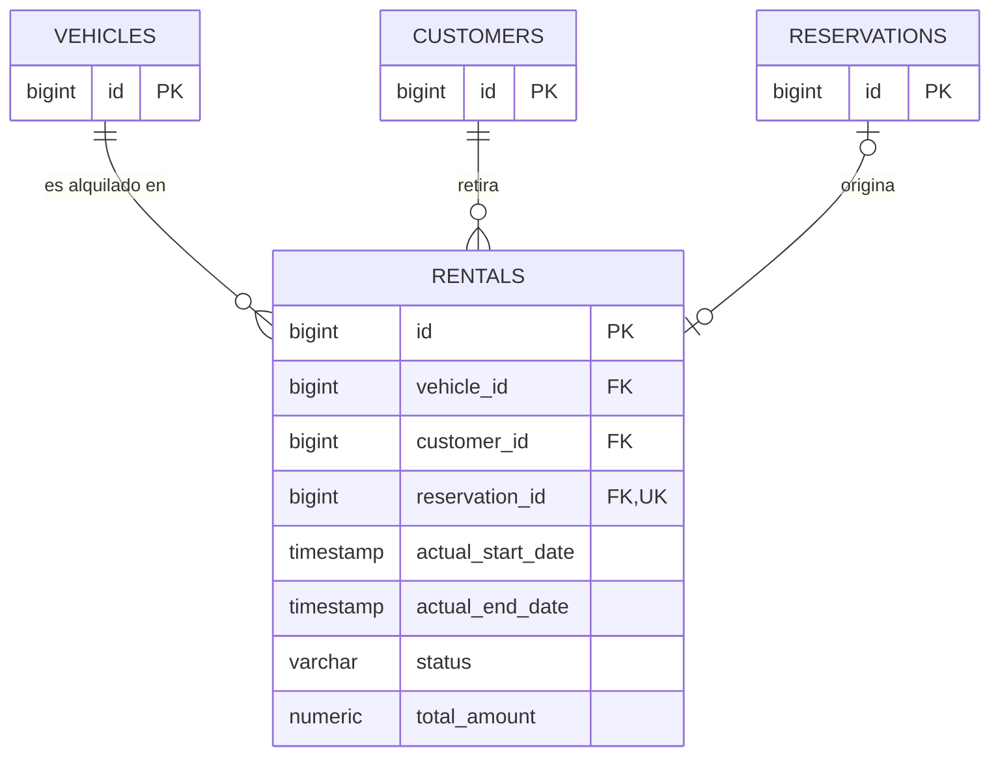
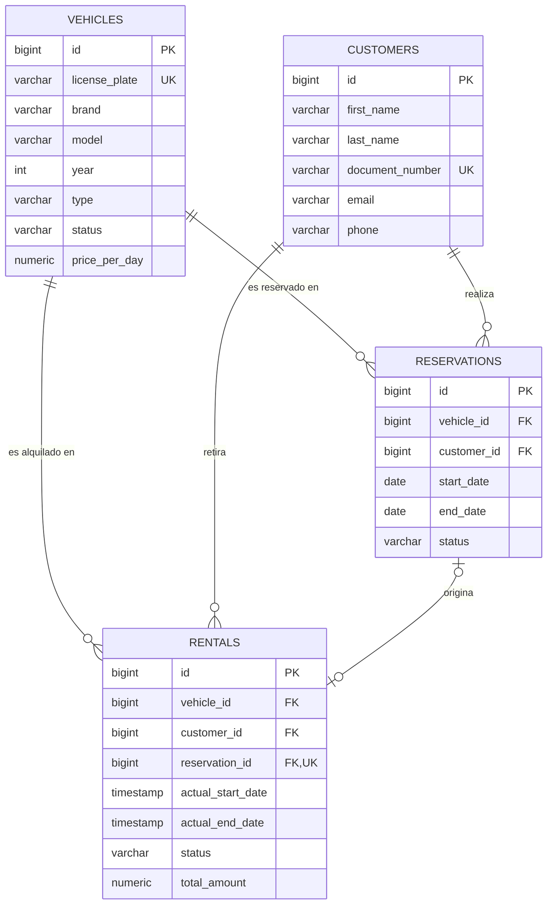

# Fase 4 — Parte 3 (mariocardona970546): tabla `rentals`

**Alcance**: tabla `rentals`, a partir de la clase `Alquiler` modelada en
`docs/03-uml/03-alquileres-mariocardona970546.md` y de los requerimientos RF34-RF41, RN04, RN05,
RN11, RN13, RN14 de `docs/02-requerimientos.md`.

Las tablas `vehicles` y `customers` son responsabilidad de la Parte 1 (Johann-Tafur) y la tabla
`reservations` de la Parte 2 (chaarlyez, `02-reservas-chaarlyez.md`) — acá se referencian solo como
tablas colaboradoras (claves foráneas), sin redefinir sus columnas. El orden de creación de las 4
tablas del sistema es `vehicles`, `customers` → `reservations` → `rentals`, por las dependencias de
FK.

---

## 1. Modelo lógico

| Columna | Tipo | Restricciones | Corresponde a |
|---|---|---|---|
| `id` | `BIGSERIAL` | `PRIMARY KEY` | `Alquiler.id` |
| `vehicle_id` | `BIGINT` | `NOT NULL`, `REFERENCES vehicles(id)` | relación `Vehiculo 1 — 0..* Alquiler` |
| `customer_id` | `BIGINT` | `NOT NULL`, `REFERENCES customers(id)` | relación `Cliente 1 — 0..* Alquiler` |
| `reservation_id` | `BIGINT` | `NULL`, `UNIQUE`, `REFERENCES reservations(id)` | relación `Reserva 0..1 — 0..1 Alquiler` (RN04: alquiler directo sin reserva) |
| `actual_start_date` | `TIMESTAMP` | `NOT NULL` | `Alquiler.fechaInicioReal` |
| `actual_end_date` | `TIMESTAMP` | `NULL` (se completa recién al finalizar) | `Alquiler.fechaFinReal` |
| `status` | `VARCHAR(20)` | `NOT NULL DEFAULT 'ACTIVE'`, `CHECK (status IN ('ACTIVE','FINISHED'))` | `Alquiler.estado` (`EstadoAlquiler`) |
| `total_amount` | `NUMERIC(10,2)` | `NULL` (se calcula recién al finalizar), `CHECK (total_amount >= 0)` | `Alquiler.montoTotal` |

Notas de diseño:
- `actual_start_date`/`actual_end_date` son `TIMESTAMP` (con hora), a diferencia de
  `reservations.start_date`/`end_date` que son `DATE` — RN13 calcula los días efectivos en
  períodos de 24 h con 1 hora de tolerancia desde el retiro, así que hace falta conocer el momento
  exacto, no solo el día (mismo criterio ya documentado en la Fase 3, sección 2 de
  `03-alquileres-mariocardona970546.md`).
- `reservation_id` es la única FK opcional (`NULL` permitido) de las 4 tablas: RN04 dice
  explícitamente que un alquiler puede ser directo, sin reserva de origen. Además lleva `UNIQUE`:
  la multiplicidad `Reserva 0..1 — 0..1 Alquiler` del diagrama de clases integrado (Fase 3, sección
  3) exige que una reserva derive en **como máximo un** alquiler, no en varios — sin `UNIQUE`, nada
  impediría que dos alquileres distintos referenciaran la misma reserva.
- `actual_end_date` y `total_amount` nacen en `NULL` porque un alquiler recién creado está
  `ACTIVE` (RF34) — ambos se completan cuando el empleado registra la devolución (RF37, RF38). No
  se usa `0` como valor por defecto de `total_amount` para no confundir "todavía no calculado" con
  "el alquiler cuesta cero".
- `total_amount` es `NUMERIC` (no `FLOAT`/`DOUBLE`), mismo criterio que `vehicles.price_per_day`
  (Parte 1) para evitar errores de redondeo en montos de dinero.
- `status` se modela como `VARCHAR` + `CHECK`, no como tipo `ENUM` nativo de PostgreSQL, mismo
  criterio de simplicidad junior usado en `reservations.status` (Parte 2) — evita la complejidad de
  `ALTER TYPE` si se agrega un estado más adelante.
- El cálculo de días efectivos (RN13) y el monto total (RN05) son lógica de **negocio**, no algo
  que un `CHECK` pueda expresar (dependen de una fórmula con tolerancia horaria). Se implementan en
  la capa de servicio en la Fase 6; acá solo se guarda el resultado final en `total_amount`.
- El bloqueo de nuevas reservas mientras el vehículo tiene un alquiler `ACTIVE` (RN14) tampoco es
  una restricción de esquema — se valida en la capa de servicio al crear una reserva (ver
  `docs/04-base-de-datos/02-reservas-chaarlyez.md`, sección 1).
- No se agregan columnas de auditoría (`created_at`, etc.) porque ningún requerimiento las pide —
  mismo criterio que el resto del sistema.

## 2. Script SQL

```sql
CREATE TABLE rentals (
    id                 BIGSERIAL PRIMARY KEY,
    vehicle_id         BIGINT NOT NULL REFERENCES vehicles(id),
    customer_id        BIGINT NOT NULL REFERENCES customers(id),
    reservation_id     BIGINT UNIQUE REFERENCES reservations(id),
    actual_start_date  TIMESTAMP NOT NULL,
    actual_end_date    TIMESTAMP,
    status             VARCHAR(20) NOT NULL DEFAULT 'ACTIVE'
                       CHECK (status IN ('ACTIVE', 'FINISHED')),
    total_amount       NUMERIC(10,2)
                       CHECK (total_amount IS NULL OR total_amount >= 0),
    CONSTRAINT chk_rentals_dates CHECK (actual_end_date IS NULL OR actual_end_date > actual_start_date)
);

-- Soporta eficientemente RN14: "¿este vehículo tiene ya un alquiler ACTIVE?"
CREATE INDEX idx_rentals_vehicle_status ON rentals (vehicle_id, status);

-- Soporta RF41: historial de alquileres de un cliente puntual, buscando por documento
-- (el JOIN hacia customers.document_number vive en la Parte 1; este índice cubre el lado rentals).
CREATE INDEX idx_rentals_customer ON rentals (customer_id);
```

`chk_rentals_dates` cubre RF37 (la fecha real de devolución, cuando existe, debe ser posterior al
retiro).

## 3. Diagrama entidad-relación (porción de esta parte)



`VEHICLES`, `CUSTOMERS` y `RESERVATIONS` se muestran solo con su PK como placeholder — sus columnas
completas están en `01-johann-tafur-vehiculos-clientes.md` (pendiente de entrega) y
`02-reservas-chaarlyez.md`.

## 4. Trazabilidad

| Elemento | Requerimientos / Reglas |
|---|---|
| Columnas y tipos | RF34, RF37 |
| FKs `vehicle_id`, `customer_id` | RF34, RF35 |
| `reservation_id` opcional | RF34, RN04 |
| `chk_rentals_dates` | RF37 |
| `status DEFAULT 'ACTIVE'` | RF34, RN11 |
| `total_amount` (`NUMERIC`, calculado al finalizar) | RF38, RN05, RN13 |
| Índice `idx_rentals_vehicle_status` | RF13, RF28, RF36, RN14 |
| Índice `idx_rentals_customer` | RF41 |

---

## 5. Integración final del script SQL y del diagrama ER

Con las 3 partes ya entregadas (`01-johann-tafur-vehiculos-clientes.md`,
`02-reservas-chaarlyez.md` y esta parte), se arma acá el script único y el ER completo del
sistema — misma mecánica que la integración del diagrama de clases en la Fase 3.

### 5.1 Script SQL completo

```sql
-- 1) vehicles y customers (Parte 1 - Johann-Tafur) — sin FKs salientes, van primero.

CREATE TABLE vehicles (
    id             BIGSERIAL PRIMARY KEY,
    license_plate  VARCHAR(10) NOT NULL UNIQUE,
    brand          VARCHAR(50) NOT NULL,
    model          VARCHAR(50) NOT NULL,
    year           INT NOT NULL,
    type           VARCHAR(30) NOT NULL,
    status         VARCHAR(20) NOT NULL DEFAULT 'AVAILABLE'
                   CHECK (status IN ('AVAILABLE', 'RENTED', 'MAINTENANCE')),
    price_per_day  NUMERIC(10,2) NOT NULL
);

CREATE INDEX idx_vehicles_status ON vehicles (status);

CREATE TABLE customers (
    id               BIGSERIAL PRIMARY KEY,
    first_name       VARCHAR(50) NOT NULL,
    last_name        VARCHAR(50) NOT NULL,
    document_number  VARCHAR(20) NOT NULL UNIQUE,
    email            VARCHAR(100),
    phone            VARCHAR(20)
);

CREATE INDEX idx_customers_last_name ON customers (last_name);

-- 2) reservations (Parte 2 - chaarlyez) — depende de vehicles y customers.

CREATE TABLE reservations (
    id            BIGSERIAL PRIMARY KEY,
    vehicle_id    BIGINT NOT NULL REFERENCES vehicles(id),
    customer_id   BIGINT NOT NULL REFERENCES customers(id),
    start_date    DATE NOT NULL,
    end_date      DATE NOT NULL,
    status        VARCHAR(20) NOT NULL DEFAULT 'PENDING'
                  CHECK (status IN ('PENDING', 'CONFIRMED', 'CANCELLED')),
    CONSTRAINT chk_reservations_dates CHECK (end_date > start_date)
);

CREATE INDEX idx_reservations_vehicle_dates ON reservations (vehicle_id, start_date, end_date);

-- 3) rentals (Parte 3 - mariocardona970546) — depende de vehicles, customers y reservations.

CREATE TABLE rentals (
    id                 BIGSERIAL PRIMARY KEY,
    vehicle_id         BIGINT NOT NULL REFERENCES vehicles(id),
    customer_id        BIGINT NOT NULL REFERENCES customers(id),
    reservation_id     BIGINT UNIQUE REFERENCES reservations(id),
    actual_start_date  TIMESTAMP NOT NULL,
    actual_end_date    TIMESTAMP,
    status             VARCHAR(20) NOT NULL DEFAULT 'ACTIVE'
                       CHECK (status IN ('ACTIVE', 'FINISHED')),
    total_amount       NUMERIC(10,2)
                       CHECK (total_amount IS NULL OR total_amount >= 0),
    CONSTRAINT chk_rentals_dates CHECK (actual_end_date IS NULL OR actual_end_date > actual_start_date)
);

CREATE INDEX idx_rentals_vehicle_status ON rentals (vehicle_id, status);
CREATE INDEX idx_rentals_customer ON rentals (customer_id);
```

### 5.2 Diagrama ER completo del sistema



Revisión de coherencia cruzada entre las 3 partes (nombres, tipos, constraints) en
`docs/04-base-de-datos/04-revision-integracion.md` — sin contradicciones encontradas.

## 6. Qué falta validar

- [x] ¿Las columnas y tipos de `rentals` (sección 1) son correctos y suficientes para RF34-RF39? →
      **Sí.**
- [x] ¿El `CHECK` de fechas y el `DEFAULT` de `status` (sección 2) reflejan bien RF37 y RN11? →
      **Sí.**
- [x] ¿Los índices son los adecuados para soportar RN14 (bloqueo por alquiler activo) y RF41
      (historial por cliente)? → **Sí.**
- [x] ¿Las FKs a `vehicles` y `customers` (sección 3) son consistentes con lo que entregó la
      Parte 1? → **Sí**, confirmado en `04-revision-integracion.md`.
- [x] Integración final del script SQL y del diagrama ER completo (sección 5) → **Hecha.**

**Parte 3 validada, con la integración final completa.** Con esto se cierra formalmente la
**Fase 4** en `docs/00-roadmap.md` y `CLAUDE.md`.
